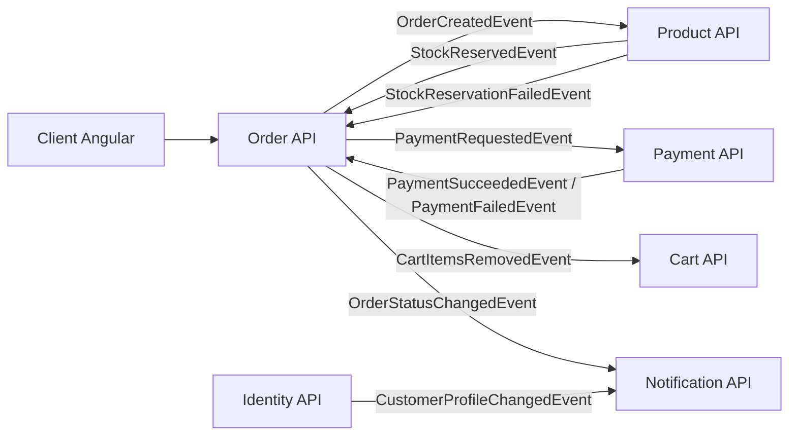
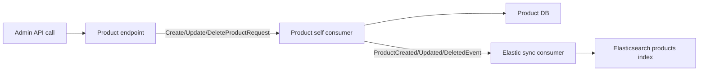
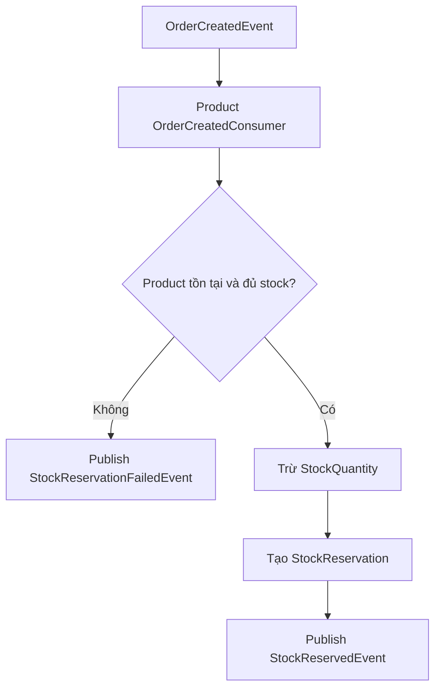
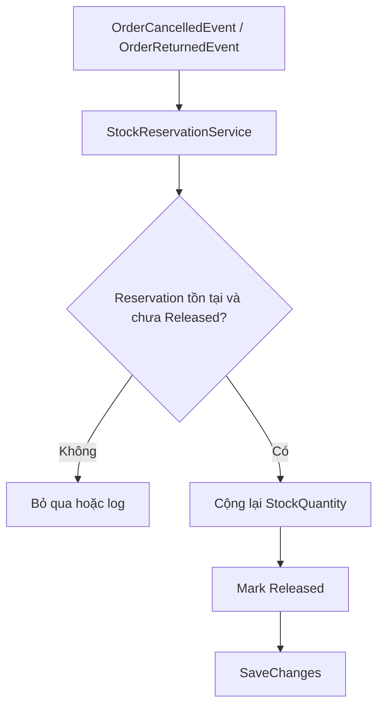
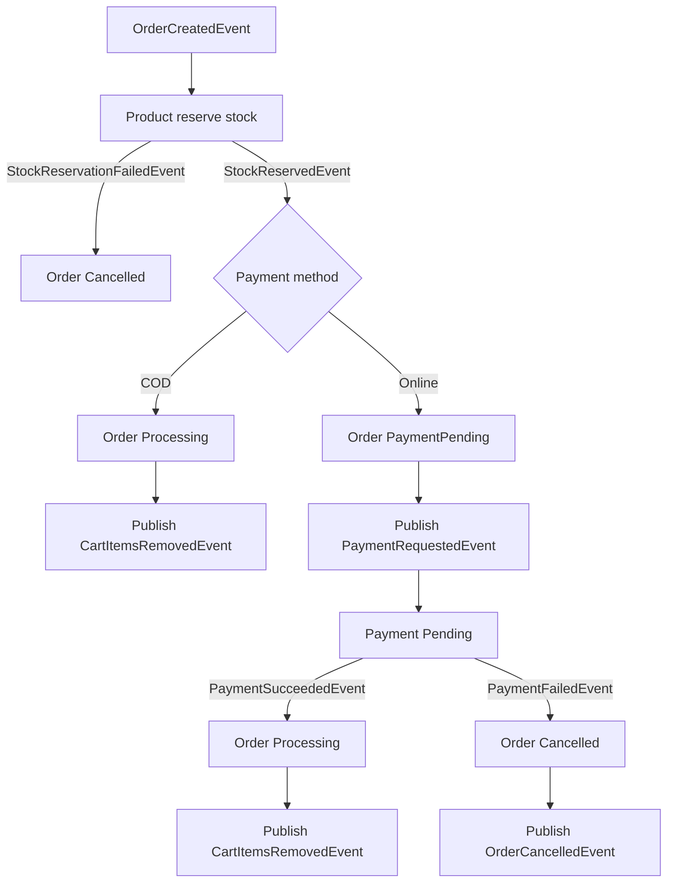
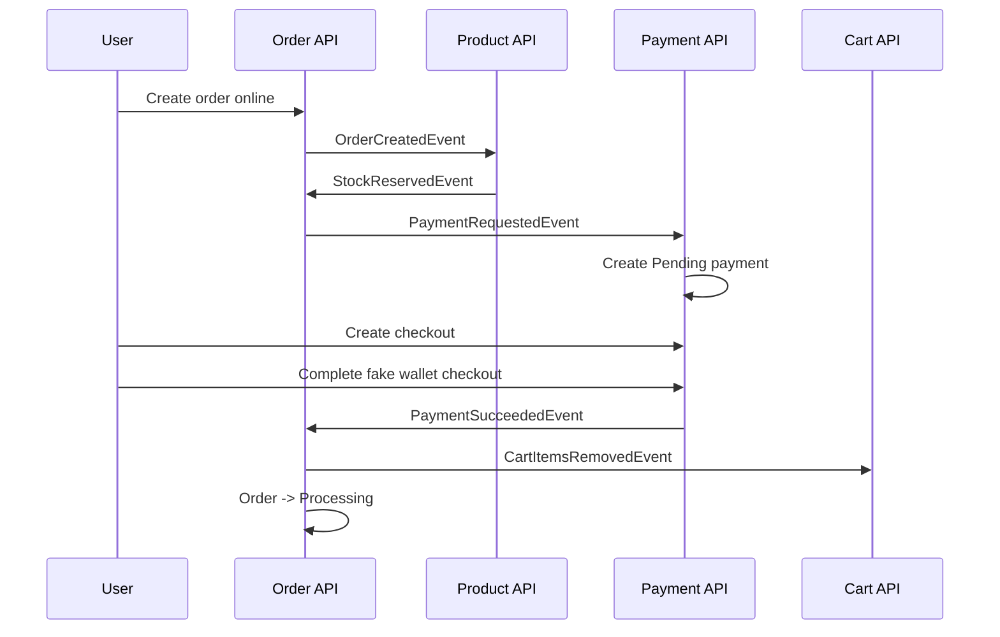

# Review tổng thể dự án shopping-web

Ngày review: 2026-05-22  
Phạm vi chính: backend repo `shopping-web`  
Phạm vi phụ: frontend Angular ở `C:\Users\THUC\App\web-store-angular` được rà nhẹ qua các file chính.

## 1. Bức tranh tổng quan

Dự án hiện tại đã đi khá xa so với một CRUD ecommerce cơ bản. Nó đang theo hướng microservices, mỗi service có database riêng, giao tiếp bất đồng bộ bằng RabbitMQ/MassTransit, có Redis cho cart/idempotency, có Elasticsearch cho search, và đã bắt đầu có notification service.

Các khối chính đang có:

- `AppHost`: chạy orchestration bằng .NET Aspire.
- `ServiceDefault`: gom cấu hình chung cho API service.
- `EventBus`: gom contracts, validation filter, idempotency filter, migration helper.
- `Identity`: đăng ký, đăng nhập, refresh token, JWT bất đối xứng.
- `Product`: catalog, category, stock, reservation, seed data, sync Elasticsearch.
- `Cart`: giỏ hàng bằng Redis.
- `Order`: tạo đơn, status flow, admin shipment/return.
- `Payment`: tạo payment pending, fake wallet checkout, webhook, timeout.
- `Notification`: in-app notification theo event của Identity và Order.
- Frontend Angular: catalog, cart, order, payment, admin product/payment, search.

Luồng lớn hiện tại:

## 2. AppHost và infrastructure đang có

File chính:

- `AppHost/Program.cs`
- `AppHost/appsettings.Development.json`
- `AppHost/AppHost.csproj`

AppHost đang tạo các resource:

- PostgreSQL:
  - Có data volume.
  - Có pgAdmin.
  - Có database riêng:
    - `order-db`
    - `product-db`
    - `identity-db`
    - `payment-db`
    - `notification-db`
- RabbitMQ:
  - Có username/password từ Aspire parameter.
  - Có management plugin.
- Redis:
  - Dùng cho Cart.
  - Dùng cho idempotency.
- Elasticsearch:
  - Đang được nối vào Product API.

AppHost đang chạy các project:

- `order-api`
- `cart-api`
- `product-api`
- `identity-api`
- `payment-api`
- `notification-api`

Điểm tốt:

- Mỗi service có database riêng. Đây là hướng đúng cho microservices.
- Service nào cần RabbitMQ/Redis/DB đều được `.WithReference(...)` và `.WaitFor(...)`.
- Notification service mới đã được đưa vào AppHost.

Điểm cần chú ý:

- `AppHost/appsettings.Development.json` vẫn có password dev. Với môi trường học tập/dev thì được, nhưng production phải chuyển sang user-secrets, environment variables, hoặc secret store.
- Nếu đổi password trong AppHost mà volume PostgreSQL cũ vẫn giữ user/password cũ thì service có thể fail. Lúc đó xóa volume là cách reset dev, còn production thì không làm vậy.
- Elasticsearch mới được nối vào Product nhưng phần search vẫn còn rough, nói kỹ ở mục Product/Search.

## 3. ServiceDefault đang có

File chính:

- `ServiceDefault/ServiceDefaultExtensions.cs`

ServiceDefault đang gom:

- `AddProblemDetails()`
- `AddHealthChecks()`
- `AddHttpLogging()`
- CORS frontend.
- JWT authentication dùng RSA public key.
- `UseExceptionHandler()`
- `UseHttpLogging()`
- `UseCors()`

Điểm tốt:

- Các service không phải copy cấu hình JWT/CORS/logging.
- JWT validation đã dùng:
  - `ValidateIssuer = true`
  - `ValidateAudience = true`
  - `ValidateLifetime = true`
  - `ValidateIssuerSigningKey = true`
  - public key từ config.

Điểm chưa ổn:

- CORS fallback production đang là `https://example.com`. Khi deploy thật mà quên config `Cors:AllowedOrigins`, frontend thật sẽ bị chặn.
- JWT public/private key hiện vẫn nằm trong `appsettings.json` của service. Với private key của Identity, đây là điểm rất nhạy cảm nếu repo public.

Khuyến nghị:

- Giữ public key trong config chung có thể chấp nhận được.
- Private key của Identity nên chuyển ra user-secrets hoặc environment variable.
- Production nên có `Cors:AllowedOrigins` rõ ràng.

## 4. EventBus building block đang có

Folder chính:

- `src/BuildingBlocks/EventBus/Contracts`
- `src/BuildingBlocks/EventBus/Infrastructure`
- `src/BuildingBlocks/EventBus/Extensions`

### 4.1 Contracts

Đang có các nhóm event/request:

- Cart:
  - `CartItemsRemovedEvent`
- Order:
  - `OrderCreatedEvent`
  - `OrderCancelledEvent`
  - `OrderReturnedEvent`
  - `OrderStatusChangedEvent`
- Stock:
  - `StockReservedEvent`
  - `StockReservationFailedEvent`
- Payment:
  - `PaymentRequestedEvent`
  - `PaymentSucceededEvent`
  - `PaymentFailedEvent`
- Product:
  - `CreateProductRequest`
  - `UpdateProductRequest`
  - `DeleteProductRequest`
  - `ProductCreatedEvent`
  - `ProductUpdatedEvent`
  - `ProductDeletedEvent`
  - `SearchProductRequest`
- Identity:
  - `CustomerProfileChangedEvent`

Điểm tốt:

- Event contract đã tách khỏi service cụ thể.
- Các service có thể reference `EventBus` để chia sẻ message contract.
- Đã có `OrderStatusChangedEvent`, giúp Notification không cần hiểu từng action riêng lẻ.

Điểm cần cải thiện:

- Một số event đang dùng string cho status/method. Dễ mở rộng, nhưng dễ sai chính tả. Có thể giữ string cho event public contract, nhưng nên map từ enum ở domain.
- Product request đang nằm chung contract event bus. Về lâu dài nên phân biệt rõ:
  - API DTO
  - integration command
  - integration event

### 4.2 ValidationFilter

File:

- `src/BuildingBlocks/EventBus/Infrastructure/ValidationFilter.cs`

Hiện filter dùng `GetRequiredService<IValidator<T>>()`. Nghĩa là endpoint nào gắn validation filter mà quên đăng ký validator sẽ fail ngay.

Điểm tốt:

- Không còn tình trạng "gắn validation nhưng thực tế validation không chạy".
- Bug config bị lộ sớm.

Điểm đang có lỗi:

- Product update endpoint đang gắn `.AddEndpointFilter<ValidationFilter<UpdateProductRequest>>()`.
- Nhưng Product service hiện chỉ có:
  - `ProductRequestValidator`
  - `CategoryRequestValidator`
- Chưa có `UpdateProductRequestValidator`.

Hậu quả:

- `PUT /api/products/{productId}` có nguy cơ trả 500 vì không resolve được validator.

Khuyến nghị:

- Thêm `UpdateProductRequestValidator`.
- Hoặc bỏ filter khỏi update endpoint nếu chưa muốn validate.

### 4.3 IdempotencyFilter

File:

- `src/BuildingBlocks/EventBus/Infrastructure/IdempotencyFilter.cs`

Hiện filter:

- Bắt buộc request có header `x-requestid`.
- Dùng Redis key:
  - `idempotency:{path}:{requestId}`
- Nếu key chưa tồn tại:
  - set `IN_PROGRESS` với TTL 24 giờ.
  - chạy endpoint.
  - cache response trong 24 giờ.
- Nếu key đang `IN_PROGRESS`:
  - trả 409 Conflict.
- Nếu key đã có response:
  - trả response cũ.
- Nếu endpoint throw exception:
  - xóa key.
  - throw lại lỗi.

Điểm tốt:

- Chặn double click / gửi lại cùng request.
- Hữu ích với create order, create product, payment checkout.
- Redis phù hợp vì idempotency là dữ liệu tạm, không cần sống mãi.

Điểm chưa ổn:

- Key chưa scope theo HTTP method.
- Key chưa scope theo user/customer id.
- Key chưa hash body.
- Nếu hai user cùng gửi `x-requestid` trên cùng path, user sau có thể nhận cached response của user trước.
- Nếu endpoint catch exception rồi trả `Results.Problem` status 500, filter có thể cache lỗi 500 trong 24 giờ.
- `IN_PROGRESS` TTL 24 giờ là quá dài. Nếu request chết giữa chừng mà không throw được về filter, client có thể bị kẹt 24 giờ.

Khuyến nghị:

- Key nên có dạng gần hơn:
  - `idempotency:{method}:{path}:{userId}:{requestId}:{bodyHash}`
- Không cache status code `>= 500`.
- Tách TTL:
  - processing lock TTL: 30 giây đến 2 phút.
  - cached success TTL: 24 giờ.
- Nếu response là 500 thì xóa key.

## 5. Identity service đang có

Folders:

- `src/Services/Identity/Identity.API`
- `src/Services/Identity/Identity.Domain`
- `src/Services/Identity/Identity.Infrastructure`

### 5.1 Chức năng

Endpoints chính:

- `POST /api/auth/register`
- `POST /api/auth/login`
- `POST /api/auth/refresh`

Identity đang làm:

- ASP.NET Identity với entity `Customer`.
- Role user/admin.
- Seed admin account.
- Tạo access token JWT.
- Tạo refresh token.
- Hash refresh token trước khi lưu DB.
- Publish `CustomerProfileChangedEvent` khi register/login.

### 5.2 JWT

JWT hiện dùng RSA:

- Identity giữ private key để ký token.
- Các service khác chỉ cần public key để verify token.

Điểm tốt:

- Đúng hướng hơn symmetric key.
- Các service không còn giữ signing key thật.
- Nếu Cart/Order/Product/Payment/Notification bị lộ config thì attacker vẫn không ký được token mới.

Điểm chưa ổn:

- Private key đang ở `src/Services/Identity/Identity.API/appsettings.json`.
- Nếu repo bị push public, private key bị lộ.

Khuyến nghị:

- Chuyển `Jwt:PrivateKey` sang user-secrets hoặc environment variable.
- Có thể giữ `Jwt:PublicKey`, `Issuer`, `Audience` trong config chung.

### 5.3 Refresh token

Hiện đã cải thiện:

- DB lưu `RefreshTokenHash`, không lưu refresh token gốc.
- Query refresh bằng hash:
  - client gửi refresh token gốc.
  - server hash token đó.
  - so sánh hash trong DB.
- Có unique filtered index:
  - `IX_Users_RefreshTokenHash`

Điểm tốt:

- Nếu DB leak, attacker không có refresh token gốc.
- Index giúp lookup refresh token nhanh hơn.

Giới hạn hiện tại:

- Mỗi user chỉ có một refresh token active.
- Nếu login ở máy mới, refresh token cũ có thể bị thay.
- Chưa có revoke theo thiết bị.
- Chưa có bảng `RefreshTokens` riêng.

Thiết kế tốt hơn về sau:

- Tạo bảng `RefreshTokens`.
- Mỗi device/session có một refresh token.
- Lưu:
  - `TokenHash`
  - `CustomerId`
  - `CreatedAt`
  - `ExpiresAt`
  - `RevokedAt`
  - `ReplacedByTokenHash`
  - `DeviceInfo`

## 6. Product service đang có

Folders:

- `src/Services/Product/Product.API`
- `src/Services/Product/Product.Domain`
- `src/Services/Product/Product.Infrastructure`

### 6.1 Domain và database

Entities chính:

- `Product`
- `Category`
- `StockReservation`

Database schema:

- Schema PostgreSQL: `product`
- Tables:
  - `Products`
  - `Categories`
  - `StockReservations`
  - `InboxState`
  - `OutboxState`
  - `OutboxMessage`

Index/check constraint đang có:

- `Categories.Name` unique.
- `Products.Name` index.
- `Products.CategoryId` index.
- `Products.Price >= 0`.
- `Products.StockQuantity >= 0`.
- `Products.StockQuantity` là concurrency token.
- `StockReservations(OrderId, ProductId)` unique.
- `StockReservations(Status, ReservedAt)` index.
- `StockReservations.Quantity > 0`.

Điểm tốt:

- Đã có reservation ledger để tránh cộng kho hai lần khi duplicate business event.
- Unique `(OrderId, ProductId)` là hướng đúng.
- Check constraint giúp DB tự bảo vệ dữ liệu.

### 6.2 Product endpoints

Endpoints chính:

- `GET /api/products/`
- `GET /api/products/categories`
- `GET /api/products/{id}`
- `GET /api/products/search`
- `POST /api/products/`
- `PUT /api/products/{productId}`
- `DELETE /api/products/{id}`
- `POST /api/products/categories`
- `POST /api/products/seed`

Điểm tốt:

- Các endpoint write chính đã dùng MQ:
  - create product publish `CreateProductRequest`.
  - update product publish `UpdateProductRequest`.
  - delete product publish `DeleteProductRequest`.
- Admin-only đã được gắn cho create/update/delete/category.
- Có idempotency cho write endpoints.

Điểm chưa ổn:

- `POST /api/products/seed` đang public vì `.RequireAuthorization(EndpointHelpers.AdminOnly)` bị comment.
- `PUT /api/products/{productId}` đang gắn `ValidationFilter<UpdateProductRequest>` nhưng thiếu validator.
- Endpoint search chưa clamp page/pageSize.
- Search endpoint trả `DebugInformation` của Elasticsearch ra client khi lỗi. Dev thì hữu ích, production thì không nên.
- Product endpoint có nhiều comment kiểu đang học/thử nghiệm, nên dọn lại khi ổn định.

### 6.3 Product self consumers

Consumers:

- `ProductCreationConsumer`
- `ProductUpdateConsumer`
- `ProductDeleteConsumer`
- `SyncProductToElasticConsumer`

Luồng create/update/delete:

Điểm tốt:

- Product write đã quay về hướng MQ như bạn muốn.
- API chỉ nhận request và đưa việc xử lý xuống consumer.
- Dễ retry nếu consumer lỗi.

Điểm cần kiểm tra kỹ:

- `ProductUpdateConsumer` dùng `ExecuteUpdateAsync`, tức update DB trực tiếp ngay lập tức.
- Sau đó publish `ProductUpdatedEvent`.
- Vì đang dùng MassTransit EF outbox, nên cần đảm bảo publish event nằm trong outbox/consumer outbox đúng như mong muốn. Cách an toàn hơn là dùng `ConsumeContext.Publish(...)` nhất quán hoặc bọc transaction rõ ràng.
- `ProductUpdatedEvent` hiện chỉ có một phần dữ liệu: id, name, price, isActive, categoryName. Elasticsearch document có thể thiếu description/image/stock/categoryId.

### 6.4 Stock reservation

Consumers liên quan order:

- `OrderCreatedConsumer`
- `OrderCancelledConsumer`
- `OrderReturnedConsumer`
- `StockReservationService`

Luồng giữ kho:

Luồng trả kho:

Điểm tốt:

- Đã xử lý business idempotency cho stock.
- Duplicate message cùng message id được MassTransit inbox chặn.
- Duplicate business event khác message id cũng không dễ cộng kho hai lần vì reservation có trạng thái `Released`.

Điểm cần chú ý:

- Nếu helper release stock throw lỗi, MassTransit sẽ retry consumer. Đây là đúng với lỗi transient.
- Nếu lỗi là logic/data mismatch vĩnh viễn, message có thể vào error queue. Cần có quy trình vận hành error queue.
- `OrderCreatedConsumer` cần giữ code dễ đọc vì đây là consumer quan trọng nhất của Product.

## 7. Cart service đang có

Folder:

- `src/Services/Cart/Cart.API`

### 7.1 Chức năng

Cart dùng Redis hash để lưu item theo customer.

Endpoints chính:

- `GET /api/cart`
- `POST /api/cart/items`
- `PUT /api/cart/items/{productId}`
- `DELETE /api/cart/items/{productId}`
- `DELETE /api/cart/clear`

Consumer:

- `CartItemsRemovedConsumer`

Điểm tốt:

- Cart là dữ liệu tạm, dùng Redis hợp lý.
- `RemoveItemsAsync` đã được tối ưu để xóa nhiều item bằng một roundtrip `HashDeleteAsync(key, fields)`.
- Cart item write có validation và idempotency.

Điểm cần chú ý:

- Redis cart không có lịch sử/audit. Đây là bình thường với cart.
- Nếu Redis mất data thì cart mất. Dev/ecommerce bình thường có thể chấp nhận, nhưng production lớn có thể cần Redis persistence/backup.
- Cart remove sau khi order/payment thành công là best-effort qua event. Nếu event lỗi, MassTransit retry; nếu vào error queue thì cart có thể còn item cũ.

## 8. Order service đang có

Folders:

- `src/Services/Order/Order.API`
- `src/Services/Order/Order.Domain`
- `src/Services/Order/Order.Infrastructure`

### 8.1 Domain

Entity chính:

- `Order`
- `OrderDetail`
- `DeliveryInfo`

Order status:

- `Pending`
- `PaymentPending`
- `Processing`
- `Shipped`
- `Delivered`
- `ReturnRequested`
- `Returned`
- `ReturnRejected`
- `Cancelled`

Payment method:

- `COD`
- `MeiMei`
- `MeilyMeily`
- `CreditCard`
- `PayPal`

Payment state tính từ order:

- COD:
  - Delivered/ReturnRequested/ReturnRejected: `Paid`
  - Returned: `Refunded`
  - Còn lại: `Unpaid`
- Online:
  - Pending/PaymentPending/Cancelled: `Unpaid`
  - Returned: `Refunded`
  - Còn lại: `Paid`

Điểm tốt:

- Domain method bảo vệ status transition:
  - `MarkStockReserved`
  - `MarkPaymentSucceeded`
  - `CancelByCustomer`
  - `CancelDueToPaymentFailure`
  - `CancelDueToStockFailure`
  - `Ship`
  - `Deliver`
  - `RequestReturn`
  - `ApproveReturn`
  - `RejectReturn`
- Không để endpoint tự set status lung tung.

### 8.2 Database

Schema PostgreSQL: `order`

Tables:

- `Orders`
- `OrderDetails`
- `InboxState`
- `OutboxState`
- `OutboxMessage`

Indexes/check constraint:

- `Orders(CustomerId, OrderDate)`
- `Orders(Status, OrderDate)`
- `OrderDetails(ProductId)`
- `Orders.TotalAmount >= 0`
- `OrderDetails.UnitPrice >= 0`
- `OrderDetails.Quantity > 0`

Điểm tốt:

- Query list user/admin có index hỗ trợ.
- Background job timeout pending order có index `Status, OrderDate`.

Điểm có thể cải thiện:

- Admin filter theo nhiều điều kiện hơn có thể cần index bổ sung sau khi có traffic thật.
- Nếu order lớn, nên dùng cursor pagination thay vì skip/take page sâu.

### 8.3 Order endpoints

Endpoints chính:

- User:
  - `POST /api/order/`
  - `GET /api/order/`
  - `GET /api/order/{id}`
  - `PUT /api/order/{id}/cancel`
  - `PUT /api/order/{id}/return-request`
- Admin:
  - `GET /api/order/admin`
  - `PUT /api/order/{id}/ship`
  - `PUT /api/order/{id}/deliver`
  - `PUT /api/order/{id}/return-approve`
  - `PUT /api/order/{id}/return-reject`

Điểm tốt:

- User chỉ xem/hành động trên order của mình.
- Admin endpoints đã require admin.
- Write endpoints publish event và dùng outbox.
- `OrderStatusChangedEvent` đã được publish ở nhiều status transitions.

Điểm chưa ổn:

- `CreateOrderValidator` message vẫn ghi phương thức hợp lệ là `COD, CreditCard, PayPal`, trong khi enum đã có `MeiMei`, `MeilyMeily`.
- `CreateOrder` catch exception rồi return `Results.Problem`. Kết hợp với `IdempotencyFilter` hiện tại có thể cache lỗi 500.
- Một số query admin/user hiện ổn với dữ liệu nhỏ-vừa, nhưng khi dữ liệu lớn cần xem execution plan và index theo filter thật.

### 8.4 Order consumers

Consumers:

- `StockReservedConsumer`
- `StockReservationFailedConsumer`
- `PaymentSucceededConsumer`
- `PaymentFailedConsumer`

Luồng chính:

Điểm tốt:

- Luồng order-product-payment-cart đã khá rõ.
- Payment success mới remove cart, đúng cho online payment.
- Payment failure cancel order và publish `OrderCancelledEvent` để Product restore stock.

Điểm cần chú ý:

- Nếu publish event sau khi update DB mà không vào outbox cùng transaction thì có nguy cơ mất event. Hiện Order dùng EF outbox nên hướng là đúng, nhưng cần giữ nguyên pattern `Publish` rồi `SaveChanges`.
- Error queue cần được monitor, vì saga/event flow càng dài thì lỗi không thể chỉ nhìn API response.

### 8.5 OrderTimeoutService

File:

- `src/Services/Order/Order.Infrastructure/BackgroundJobs/OrderTimeoutService.cs`

Hiện job:

- Mỗi 1 phút chạy một lần.
- Tìm order `Pending` quá 15 phút.
- Cancel do chờ giữ kho quá lâu.
- Save DB.

Điểm chưa ổn:

- Job này hiện chỉ đổi DB, chưa publish `OrderStatusChangedEvent`.
- Nếu sau này Notification phụ thuộc event status, order bị timeout sẽ không có notification.
- Nếu có trường hợp đã giữ kho nhưng order vẫn bị timeout ở status khác, cần đảm bảo publish `OrderCancelledEvent` để Product restore stock. Hiện job chỉ cancel `Pending`, nên rủi ro stock thấp hơn.

Khuyến nghị:

- Inject `IPublishEndpoint`.
- Khi timeout cancel order, publish `OrderStatusChangedEvent`.
- Giữ publish trong outbox bằng cách dùng cùng `OrderDbContext` và `SaveChanges`.

## 9. Payment service đang có

Folders:

- `src/Services/Payment/Payment.API`
- `src/Services/Payment/Payment.Domain`
- `src/Services/Payment/Payment.Infrastructure`

### 9.1 Domain

Entity:

- `PaymentTransaction`

Status:

- `Pending`
- `Succeeded`
- `Failed`
- `Expired`

Domain methods:

- `MarkSucceeded`
- `MarkFailed`
- `MarkExpired`

Điểm tốt:

- Payment không tự động success khi nhận `PaymentRequestedEvent`.
- `PaymentRequestedConsumer` chỉ tạo payment `Pending`.
- Payment chỉ success/fail khi checkout/webhook/admin mock xác nhận.

### 9.2 Database

Schema PostgreSQL: `payment`

Tables:

- `Payments`
- `InboxState`
- `OutboxState`
- `OutboxMessage`

Indexes/check constraint:

- `Payments.OrderId` unique.
- `Payments(CustomerId, CreatedAt)`
- `Payments(Status, CreatedAt)`
- `Payments.Amount > 0`

Điểm tốt:

- Mỗi order chỉ có một payment transaction.
- Query admin by customer/status có index hỗ trợ.

### 9.3 Payment endpoints

Endpoints chính:

- Authenticated:
  - `GET /api/payment/order/{orderId}`
  - `GET /api/payment/providers`
  - `POST /api/payment/{id}/providers/{provider}/checkout`
- Admin:
  - `GET /api/payment/admin`
  - `GET /api/payment/admin/{id}`
  - `POST /api/payment/admin/{id}/mock-webhook`
- Anonymous:
  - `POST /api/payment/webhook`
  - `GET /api/payment/providers/{provider}/checkout/{id}`
  - `POST /api/payment/providers/{provider}/checkout/{id}/complete`

Điểm tốt:

- Provider abstraction đã tách:
  - `IPaymentProvider`
  - `FakeWalletPaymentProvider`
  - `MeiMeiPaymentProvider`
  - `MeilyMeilyPaymentProvider`
  - `PaymentProviderCatalog`
- Webhook đã có HMAC signature + timestamp chống replay cơ bản.
- Fake wallet HTML đã tách ra template riêng.
- `PaymentTimeoutService` expire pending payment và publish `PaymentFailedEvent`.

Luồng online payment:

Điểm chưa ổn:

- `Payment:WebhookSecret` đang nằm trong `appsettings.json` với giá trị dev.
- Anonymous checkout endpoints là fake wallet dev flow. Production thật phải thay bằng redirect/provider session thật.
- Admin mock webhook là công cụ test, không nên bật rộng ở production.
- Comment cũ về confirm endpoint còn trong file, nên dọn để payment endpoints bớt rối.

## 10. Notification service đang có

Folders:

- `src/Services/Notification/Notification.API`
- `src/Services/Notification/Notification.Domain`
- `src/Services/Notification/Notification.Infrastructure`

### 10.1 Chức năng

Notification hiện là in-app notification.

Nó consume:

- `CustomerProfileChangedEvent`
- `OrderStatusChangedEvent`

Mục tiêu:

- Identity publish customer profile để Notification biết customer email/full name.
- Order publish status changed để Notification tạo thông báo cho customer.

### 10.2 Domain/database

Entities:

- `NotificationRecipient`
- `NotificationMessage`

Tables:

- `Recipients`
- `Notifications`
- `InboxState`
- `OutboxState`
- `OutboxMessage`

Indexes:

- `Recipients.Email`
- `Notifications.SourceEventId` unique.
- `Notifications.DeduplicationKey` unique.
- `Notifications(CustomerId, CreatedAt)`
- `Notifications(CustomerId, IsRead, CreatedAt)`

Điểm tốt:

- Có projection người nhận riêng, không query qua Identity DB.
- Có unique key để giảm duplicate notification.
- Có inbox/outbox theo MassTransit.
- Query notification/unread có index phù hợp.

### 10.3 Notification endpoints

Endpoints:

- `GET /api/notifications`
- `GET /api/notifications/unread-count`
- `PUT /api/notifications/{id}/read`
- `PUT /api/notifications/read-all`
- `GET /api/notifications/admin`

Điểm tốt:

- User chỉ xem notification của mình.
- Admin có endpoint xem rộng hơn.
- Pagination có clamp `pageSize` tối đa 100.

Điểm chưa hoàn thiện:

- Frontend chưa có UI notification.
- Chưa có realtime SignalR.
- Chưa có email/SMS/push provider.
- Existing users trước khi có `CustomerProfileChangedEvent` sẽ chưa có recipient projection cho tới khi họ login/register lại.

Khuyến nghị:

- Sprint sau thêm frontend notification bell.
- Sau đó thêm SignalR để notification realtime.
- Nếu muốn email, thêm provider abstraction:
  - `INotificationDeliveryProvider`
  - `EmailDeliveryProvider`
  - `SmsDeliveryProvider`
  - `PushDeliveryProvider`

## 11. Elasticsearch/Search đang có

File chính:

- `src/Services/Product/Product.API/Program.cs`
- `src/Services/Product/Product.API/Endpoints/ProductEndpoints.cs`
- `src/Services/Product/Product.API/IntegrationEvents/Consumers/Elastic`

Đang có:

- AppHost resource Elasticsearch.
- Product API inject `ElasticsearchClient`.
- `GET /api/products/search`.
- Consumer sync:
  - `ProductCreatedEvent`
  - `ProductUpdatedEvent`
  - `ProductDeletedEvent`

Điểm tốt:

- Search tách ra Elasticsearch là hướng đúng nếu catalog lớn.
- Sync qua event phù hợp với microservices.

Điểm chưa ổn:

- Search index chưa có lifecycle/mapping rõ ràng.
- `ProductEsDocument` hiện chưa đủ dữ liệu so với UI cần:
  - stock quantity
  - description
  - image url
  - category id
- `ProductCreatedEvent`/`ProductUpdatedEvent` chưa thống nhất dữ liệu.
- Endpoint search trả debug information ra client khi lỗi.
- Page/pageSize chưa được validate/clamp ở backend.
- Nếu Elasticsearch down, product API search fail. Frontend có fallback local nhưng backend chưa có fallback DB search.

Khuyến nghị:

- Chuẩn hóa `ProductEsDocument`.
- Chuẩn hóa event data cho created/updated.
- Tạo index mapping khi service start hoặc bằng migration/tool riêng.
- Không trả `DebugInformation` ra client.
- Thêm validator/clamp cho search request.

## 12. Frontend Angular đang có

Folder ngoài repo backend:

- `C:\Users\THUC\App\web-store-angular`

Files chính:

- `src/app/app.ts`
- `src/app/app.html`
- `src/app/app.css`
- `src/app/api.service.ts`

Đang có:

- Catalog/product list.
- Search UI.
- Category/stock filter.
- Cart.
- Login/register.
- Checkout.
- Order list.
- Pay now.
- Fake wallet checkout mở tab mới.
- Admin product create/edit/delete.
- Admin payment list.
- Admin mock payment success/fail.
- Disable/busy state cho nhiều action:
  - place order
  - pay now
  - cancel/order action
  - product save/delete
  - admin mock payment
- `x-requestid` được tự tạo cho request không phải GET.

Điểm tốt:

- Frontend đã bắt kịp khá nhiều backend flow.
- Payment provider được load động từ Payment API.
- Có fallback search local nếu search API lỗi.

Điểm chưa ổn:

- Chưa có notification UI.
- `app.ts` đang rất lớn, gom quá nhiều logic vào một component.
- Chưa có route/module tách trang.
- `x-requestid` hiện mỗi request tạo random mới. Tốt cho double click prevention ở mức client hiện tại, nhưng nếu muốn retry cùng request thật sự thì phải reuse cùng id cho cùng action attempt.
- Frontend đang nói chuyện trực tiếp nhiều service base URL. Về lâu dài nên cân nhắc API Gateway/BFF.

Khuyến nghị:

- Tách frontend thành:
  - `ProductPage`
  - `CartPanel`
  - `OrdersPage`
  - `AdminProductsPanel`
  - `AdminPaymentsPanel`
  - `NotificationBell`
  - `ApiService`
  - `AuthService`
- Thêm notification bell trước, sau đó mới realtime.

## 13. Những điểm đang tốt

Dự án hiện có nhiều phần tốt:

- Service tách khá rõ theo domain.
- DB riêng cho service.
- Có outbox/inbox cho các service quan trọng.
- Có Redis cho cart/idempotency.
- Có JWT bất đối xứng.
- Refresh token đã hash.
- Product stock đã có reservation ledger.
- Payment đã có pending/succeeded/failed/expired.
- Fake wallet giúp test flow online payment.
- Webhook đã có HMAC signature.
- Notification service đã có nền tảng in-app notification.
- Frontend đã dùng được nhiều flow backend.
- Build gần nhất sau khi thêm Notification service đã pass.

## 14. Những thứ đang không ổn theo mức ưu tiên

### P0 - Product update endpoint có thể fail vì thiếu validator

File liên quan:

- `src/Services/Product/Product.API/Endpoints/ProductEndpoints.cs`
- `src/Services/Product/Product.API/Validators/ProductRequestValidator.cs`
- `src/BuildingBlocks/EventBus/Contracts/ProductEvents.cs`

Vấn đề:

- Endpoint `PUT /api/products/{productId}` gắn `ValidationFilter<UpdateProductRequest>`.
- Nhưng chưa có `IValidator<UpdateProductRequest>`.
- Vì `ValidationFilter` dùng `GetRequiredService`, endpoint có thể trả 500.

Hướng sửa:

- Thêm `UpdateProductRequestValidator`.
- Hoặc tạm thời bỏ validation filter ở endpoint update.

### P0/P1 - Secret/key đang nằm trong appsettings

File liên quan:

- `src/Services/Identity/Identity.API/appsettings.json`
- `src/Services/Payment/Payment.API/appsettings.json`
- `AppHost/appsettings.Development.json`

Vấn đề:

- Identity private key nằm trong appsettings.
- Payment webhook secret nằm trong appsettings.
- Dev password nằm trong AppHost appsettings.

Rủi ro:

- Nếu repo public, private key và secret bị lộ.
- Attacker có private key có thể ký JWT.
- Attacker có webhook secret có thể giả payment webhook.

Hướng sửa:

- Dev: dùng user-secrets.
- Production: dùng env/secrets manager.
- Rotate lại key/secret nếu từng push public.

### P1 - Idempotency key chưa đủ an toàn và có thể cache lỗi 500

File liên quan:

- `src/BuildingBlocks/EventBus/Infrastructure/IdempotencyFilter.cs`
- `src/Services/Order/Order.API/Endpoints/OrderEndpoints.cs`

Vấn đề:

- Key chỉ gồm path + requestId.
- Không gồm method.
- Không gồm user id/customer id.
- Không gồm body hash.
- Cache mọi status code, kể cả 500 nếu endpoint trả `Results.Problem`.
- Lock `IN_PROGRESS` TTL 24 giờ.

Hướng sửa:

- Key: method + path + userId + requestId + bodyHash.
- Không cache status `>= 500`.
- Lock TTL ngắn.
- Response TTL dài.

### P1 - Product seed endpoint đang public

File:

- `src/Services/Product/Product.API/Endpoints/ProductEndpoints.cs`

Vấn đề:

- `POST /api/products/seed` không require admin.

Rủi ro:

- Ai gọi được endpoint có thể seed lại data.
- Có thể tạo dữ liệu rác hoặc spam Elasticsearch.

Hướng sửa:

- Bật lại `.RequireAuthorization(EndpointHelpers.AdminOnly)`.
- Hoặc chỉ map endpoint này trong Development.

### P1 - OrderTimeoutService đổi status nhưng chưa publish event

File:

- `src/Services/Order/Order.Infrastructure/BackgroundJobs/OrderTimeoutService.cs`

Vấn đề:

- Job cancel order pending quá lâu.
- Nhưng không publish `OrderStatusChangedEvent`.

Rủi ro:

- Notification không biết order bị timeout.
- Các service khác sau này nếu nghe status changed cũng không nhận được.

Hướng sửa:

- Inject `IPublishEndpoint`.
- Publish `OrderStatusChangedEvent`.
- Save bằng outbox.

### P1 - Search/Elasticsearch chưa đủ chuẩn để coi là production-ready

File liên quan:

- `src/Services/Product/Product.API/Endpoints/ProductEndpoints.cs`
- `src/Services/Product/Product.API/IntegrationEvents/Consumers/Elastic`

Vấn đề:

- Document thiếu field.
- Event created/updated thiếu thống nhất.
- Search trả debug ra client.
- Chưa clamp page/pageSize.
- Chưa rõ mapping/index creation.

Hướng sửa:

- Chuẩn hóa search document.
- Chuẩn hóa event payload.
- Thêm request validation.
- Ẩn debug info.
- Tạo mapping rõ ràng.

### P1 - Chưa có test

Vấn đề:

- Dự án đã có nhiều event flow dài.
- Chưa thấy test project.

Rủi ro:

- Sửa một service có thể làm gãy flow service khác.
- Những lỗi như validator thiếu hoặc event không publish chỉ phát hiện khi chạy tay.

Hướng test nên làm:

- Unit test domain:
  - Order status transition.
  - Payment status transition.
  - StockReservation release.
- Integration test API:
  - Auth register/login/refresh.
  - Create order.
  - Product update validation.
- Event flow test:
  - order -> stock reserved -> payment requested.
  - payment failed -> order cancelled -> stock released.
  - order status changed -> notification created.

### P2 - Notification mới có in-app, chưa có UI/realtime/delivery

Vấn đề:

- Backend notification có rồi.
- Frontend chưa hiển thị.
- Chưa có SignalR/email/SMS.

Hướng sửa:

- Thêm notification bell frontend.
- Thêm unread count.
- Sau đó thêm SignalR.
- Sau nữa mới thêm email/SMS provider.

### P2 - Frontend app component đang quá lớn

File:

- `C:\Users\THUC\App\web-store-angular\src\app\app.ts`

Vấn đề:

- Một component đang chứa product, cart, order, payment, admin, search.

Rủi ro:

- Khó bảo trì.
- Dễ sửa phần payment nhưng làm ảnh hưởng product/order.

Hướng sửa:

- Tách component/service theo domain.

### P2 - Payment endpoints còn nhiều logic trong một file

File:

- `src/Services/Payment/Payment.API/Endpoints/PaymentEndpoints.cs`

Vấn đề:

- File khá dài.
- Chứa user endpoint, admin endpoint, webhook, checkout page, helper HMAC.

Hướng sửa:

- Tách:
  - `PaymentQueryEndpoints`
  - `PaymentCheckoutEndpoints`
  - `PaymentWebhookEndpoints`
  - `PaymentAdminEndpoints`
  - `WebhookSignatureVerifier`

### P2 - Refresh token chưa hỗ trợ multi-device

Vấn đề:

- User chỉ có một `RefreshTokenHash`.

Hướng sửa:

- Tạo bảng `RefreshTokens`.
- Hỗ trợ nhiều session/device.
- Có revoke.

### P2 - Migration/deployment strategy chưa rõ

Vấn đề:

- App tự migrate trong Development.
- Production chưa có chiến lược migrate.

Hướng sửa:

- Dev giữ auto migrate.
- Production nên dùng migration job/CI/CD step.
- Không để nhiều instance cùng auto migrate tùy tiện.

### P2 - Observability còn cơ bản

Đang có:

- Logging.
- Health checks.
- Http logging.

Chưa rõ:

- Distributed tracing.
- Correlation id xuyên service.
- Dashboard error queue.
- Metrics cho RabbitMQ/Redis/Postgres.

Hướng sửa:

- Thêm OpenTelemetry.
- Dùng correlation id.
- Log event id/order id/customer id nhất quán.
- Có dashboard/guide xem MassTransit error queues.

## 15. Thứ tự xử lý đề xuất

### Sprint gần nhất

1. Fix Product update validator.
2. Bật admin-only hoặc dev-only cho product seed endpoint.
3. Sửa idempotency:
   - key có method/user/body hash.
   - không cache 500.
   - lock TTL ngắn.
4. Chuyển Identity private key và Payment webhook secret ra user-secrets/env.
5. OrderTimeoutService publish `OrderStatusChangedEvent`.
6. Thêm notification UI cơ bản trên frontend.

### Sprint sau đó

1. Làm test nền:
   - domain unit test.
   - API integration test.
   - event flow test quan trọng.
2. Làm search chuẩn:
   - mapping.
   - document đầy đủ.
   - sync ổn định.
3. Tách frontend component.
4. Tách Payment endpoint file.
5. Thêm SignalR notification.

### Sprint xa hơn

1. API Gateway/BFF.
2. Multi-device refresh token.
3. Email/SMS notification providers.
4. Observability đầy đủ với OpenTelemetry.
5. Admin dashboard cho event/error queue.

## 16. Kết luận

Dự án hiện đã có nền tảng khá tốt cho ecommerce microservices:

- auth có RSA JWT.
- order/payment/product/cart đã đi bằng event.
- stock đã có reservation ledger.
- payment không còn auto success.
- notification service đã được dựng.
- frontend đã bắt được nhiều flow.

Nhưng dự án cũng đã vượt qua ngưỡng "code demo đơn giản", nên các rủi ro bây giờ chủ yếu nằm ở reliability/security/maintainability:

- idempotency cần sửa sớm.
- secrets cần đưa ra khỏi appsettings.
- Product update validator đang thiếu.
- seed endpoint không nên public.
- event flow cần test.
- notification frontend chưa có.
- search còn cần chuẩn hóa.

Nếu muốn chọn việc làm ngay nhất, mình sẽ chọn:

1. Fix validator + seed endpoint.
2. Fix idempotency.
3. Move secrets.
4. Add notification UI.
5. Bắt đầu test cho order-payment-product flow.
