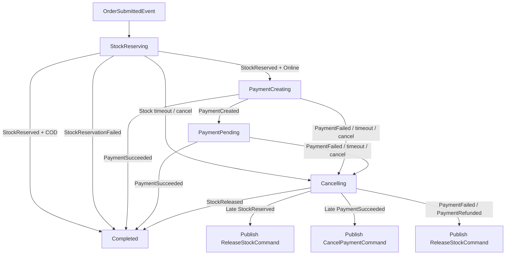

# Order Saga Guide

Tài liệu này giải thích saga orchestrator mới của Order service theo hướng dễ đọc code. Mục tiêu là khi nhìn vào `OrderStateMachine.cs`, bạn biết state nào đang chờ gì, event nào làm gì, và vì sao có các activity bù trừ như cancel payment, refund, release stock.

## 1. Saga Là Gì Trong Project Này

Saga là workflow xử lý đơn hàng kéo dài qua nhiều service:

- Order service tạo đơn.
- Product service giữ hàng hoặc hoàn kho.
- Payment service tạo payment, xác nhận thành công, thất bại hoặc refund.
- Cart service xóa item khỏi giỏ khi đơn thành công.

Saga không xử lý mọi thứ trong một request HTTP. Nó sống bằng event/message RabbitMQ. Mỗi lần một service trả lời, saga đọc message đó, cập nhật trạng thái, rồi gửi command tiếp theo.

Trong project này:

- `OrderSagaInstance` là row lưu trạng thái saga trong database.
- `OrderStateMachine` là bản đồ workflow.
- Các activity trong `OrderStateMachine.cs` là nơi update `Order`, thêm timeline và publish message.
- `OrderSagaTimeoutService` là background job bắn timeout event vào saga.

## 2. Các File Chính

### `Order.API/Program.cs`

Đăng ký MassTransit, RabbitMQ, EF Outbox và saga state machine.

Các dòng quan trọng:

```csharp
builder.Services.AddHostedService<OrderSagaTimeoutService>();
```

Chạy background service để phát hiện saga bị kẹt ở `StockReserving` hoặc `PaymentCreating` quá lâu.

```csharp
x.AddSagaStateMachine<OrderStateMachine, OrderSagaInstance>()
    .EntityFrameworkRepository(r =>
    {
        r.ExistingDbContext<OrderDbContext>();
        r.UsePostgres();
    });
```

Đăng ký state machine. MassTransit sẽ dùng `OrderSagaInstance` để lưu state vào PostgreSQL.

```csharp
cfg.ReceiveEndpoint("order-saga", e =>
{
    e.UseEntityFrameworkOutbox<OrderDbContext>(context);
    e.ConfigureSaga<OrderSagaInstance>(context);
});
```

Queue `order-saga` nhận event/command liên quan order saga. EF Outbox giúp xử lý message và publish message mới an toàn hơn.

### `Order.Infrastructure/Saga/OrderSagaInstance.cs`

Đây là dữ liệu saga lưu trong DB.

```csharp
public Guid CorrelationId { get; set; }
public string CurrentState { get; set; } = string.Empty;
```

`CorrelationId` là khóa của saga. Với order saga hiện tại, quy ước là:

```text
CorrelationId == OrderId
```

Vì vậy trong nhiều command bạn thấy:

```csharp
CorrelationId = ctx.Saga.CorrelationId,
OrderId = ctx.Saga.CorrelationId,
```

Nó nhìn hơi lặp, nhưng có hai ý nghĩa:

- `OrderId`: ý nghĩa business.
- `CorrelationId`: ý nghĩa messaging/tracing/saga.

Các field khác:

- `CustomerId`: dùng khi publish command sang Cart/Product/Payment.
- `PaymentMethod`: biết đơn COD hay online.
- `TotalAmount`: dùng để tạo hoặc cancel payment.
- `IsCOD`: rẽ nhánh flow.
- `FailureReason`: lý do cancel/fail/timeout.
- `CreatedAt`, `UpdatedAt`: phục vụ timeout polling.
- `StockReservedAt`, `PaymentCreatedAt`, `CompletedAt`: timestamp nội bộ saga.
- Concurrency của saga dùng PostgreSQL system column `xmin`, được map trong `OrderDbContext` bằng shadow property.

### `Order.Infrastructure/Saga/OrderSagaStateNames.cs`

Chứa tên state dùng cho query timeout:

```csharp
public const string StockReserving = nameof(StockReserving);
public const string PaymentCreating = nameof(PaymentCreating);
```

Không nên hardcode `"StockReserving"` trong timeout service vì nếu rename state thì timeout dễ chết âm thầm.

### `Order.Infrastructure/Data/OrderDbContext.cs`

Map bảng saga:

```csharp
public DbSet<OrderSagaInstance> OrderSagaInstances { get; set; } = null!;
```

Map entity:

```csharp
entity.ToTable("OrderSagaInstances", "order");
entity.HasKey(s => s.CorrelationId);
entity.Property(s => s.CurrentState).HasMaxLength(80).IsRequired();
entity.Property<uint>("xmin").IsRowVersion();
```

Và map MassTransit inbox/outbox:

```csharp
modelBuilder.AddInboxStateEntity();
modelBuilder.AddOutboxMessageEntity();
modelBuilder.AddOutboxStateEntity();
```

### `Order.API/Saga/OrderSagaTimeoutService.cs`

Background service chạy mỗi 1 phút:

```csharp
private static readonly TimeSpan PollInterval = TimeSpan.FromMinutes(1);
```

Nó query saga đang kẹt:

- `StockReserving` quá 15 phút -> publish `StockTimeoutExpired`.
- `PaymentCreating` quá 10 phút -> publish `PaymentTimeoutExpired`.

Nó không tự cancel order. Nó chỉ publish timeout event để state machine xử lý.

## 3. Syntax MassTransit State Machine

Các keyword cần nhớ:

### `InstanceState`

```csharp
InstanceState(x => x.CurrentState);
```

Nói MassTransit lưu state hiện tại vào field `CurrentState`.

### `Event`

```csharp
Event(() => StockReserved, x => x.CorrelateById(ctx => ctx.Message.OrderId));
```

Khi `StockReservedEvent` đến, MassTransit lấy `OrderId` trong message để tìm saga instance có `CorrelationId` tương ứng.

### `Initially`

```csharp
Initially(
    When(OrderSubmitted)
        ...
);
```

Luật khi saga chưa tồn tại hoặc vừa bắt đầu.

### `During`

```csharp
During(StockReserving,
    When(StockReserved)
        ...
);
```

Luật khi saga đang ở một state cụ thể.

### `When`

```csharp
When(PaymentSucceeded)
```

Khi nhận event này trong state hiện tại.

### `Then`

```csharp
.Then(ctx =>
{
    ctx.Saga.FailureReason = ctx.Message.Reason;
    ctx.Saga.UpdatedAt = DateTime.UtcNow;
})
```

Update dữ liệu saga instance. Thường dùng để set reason, timestamp, amount.

### `Activity`

```csharp
.Activity(x => x.OfType<PaymentSucceededActivity>())
```

Chạy class xử lý side effect thật: update `Order`, thêm timeline, publish message, save DB.

### `PublishAsync`

```csharp
.PublishAsync(ctx => ctx.Init<CreatePaymentCommand>(new
{
    CorrelationId = ctx.Saga.CorrelationId,
    OrderId = ctx.Saga.CorrelationId,
    ctx.Saga.CustomerId,
    Amount = ctx.Saga.TotalAmount,
    ctx.Saga.PaymentMethod
}))
```

Publish message sang service khác.

### `TransitionTo`

```csharp
.TransitionTo(PaymentPending)
```

Chuyển saga sang state mới.

### `Finalize`

```csharp
.Finalize()
```

Đánh dấu saga hoàn tất.

```csharp
SetCompletedWhenFinalized();
```

Khi saga finalized, MassTransit xem saga là completed và có thể xóa instance khỏi DB.

## 4. Flow Tổng Quát



## 5. Flow Create Order

### Bước 1: HTTP create order

Endpoint tạo order trong `OrderEndpoints.cs`:

1. Validate customer.
2. Tạo `Order`.
3. Add timeline ban đầu.
4. Publish `OrderSubmittedEvent`.
5. Save DB.

### Bước 2: Saga nhận `OrderSubmittedEvent`

Trong `OrderStateMachine`:

```csharp
Initially(
    When(OrderSubmitted)
        .Then(...)
        .PublishAsync(... ReserveStockCommand ...)
        .TransitionTo(StockReserving)
);
```

Saga lưu thông tin vào `OrderSagaInstance`, bắn `ReserveStockCommand` sang Product service, rồi chuyển sang `StockReserving`.

### Bước 3: Product service trả kết quả stock

Nếu giữ hàng thành công:

```csharp
When(StockReserved)
    .Activity(x => x.OfType<StockReservedActivity>())
```

`StockReservedActivity`:

- Load order.
- Gọi `order.MarkStockReserved(...)`.
- Lưu product snapshot vào order items.
- Add timeline.
- Publish `OrderStatusChangedEvent`.
- Save DB.

Nếu COD:

```csharp
.PublishAsync(... RemoveCartItemsCommand ...)
.Finalize()
```

COD không cần online payment, saga kết thúc.

Nếu online payment:

```csharp
.PublishAsync(... CreatePaymentCommand ...)
.TransitionTo(PaymentCreating)
```

Saga yêu cầu Payment service tạo payment.

### Bước 4: Payment service trả kết quả

Nếu tạo payment xong:

```csharp
When(PaymentCreated)
    .TransitionTo(PaymentPending)
```

Saga chờ user thanh toán.

Nếu payment thành công:

```csharp
When(PaymentSucceeded)
    .Activity(x => x.OfType<PaymentSucceededActivity>())
    .Finalize()
```

`PaymentSucceededActivity`:

- Load order.
- Gọi `order.ConfirmPayment()`.
- Add timeline.
- Publish `OrderStatusChangedEvent`.
- Publish `RemoveCartItemsCommand`.
- Save DB.
- Saga kết thúc.

Nếu payment fail:

```csharp
When(PaymentFailed)
    .Activity(x => x.OfType<PaymentFailedCancelActivity>())
    .TransitionTo(Cancelling)
```

`PaymentFailedCancelActivity`:

- Cancel order.
- Add timeline.
- Publish status changed.
- Publish `ReleaseStockCommand`.
- Save DB.
- Saga vào `Cancelling`, chờ Product service xác nhận stock released.

## 6. Flow Cancel Order

### Cancel COD đã Processing

Endpoint `CancelOrder` xử lý trực tiếp:

- Gọi `order.Cancel()`.
- Publish `ReleaseStockCommand`.
- Publish `OrderStatusChangedEvent`.
- Save DB.

Lý do: COD không còn saga active sau khi stock reserved, vì saga đã finalize.

### Cancel khi đang StockReserving

Endpoint publish:

```csharp
CancelOrderCommand
```

Saga đang `StockReserving` nhận:

```csharp
When(CancelRequested)
    .Activity(x => x.OfType<CancelOrderActivity>())
    .TransitionTo(Cancelling)
```

`CancelOrderActivity`:

- Cancel order.
- Add timeline source `Customer`.
- Publish status changed.
- Save DB.

Vì Product service có thể trả `StockReservedEvent` muộn, saga không finalize ngay mà vào `Cancelling`. Nếu stock reserved về muộn, `LateStockReservedActivity` sẽ release stock.

### Cancel khi đang PaymentCreating hoặc PaymentPending

Saga nhận:

```csharp
When(CancelRequested)
    .Activity(x => x.OfType<CancelWithCompensationActivity>())
    .TransitionTo(Cancelling)
```

`CancelWithCompensationActivity`:

- Cancel order.
- Add timeline source `Customer`.
- Publish status changed.
- Nếu online payment pending thì publish `CancelPaymentCommand`.
- Save DB.

Sau đó saga đợi Payment service trả:

- `PaymentFailedEvent`: payment cancel/fail.
- `PaymentRefundedEvent`: payment đã succeed trước đó nên cần refund.

Khi payment terminal xong, saga release stock.

## 7. Flow Timeout

### Stock timeout

`OrderSagaTimeoutService` thấy saga ở `StockReserving` quá 15 phút thì publish:

```csharp
StockTimeoutExpired
```

Saga xử lý:

```csharp
When(StockTimedOut)
    .Activity(x => x.OfType<TimeoutCancelActivity>())
    .TransitionTo(Cancelling)
```

Order bị cancel vì chờ stock quá lâu. Nếu Product service sau đó mới gửi `StockReservedEvent`, saga sẽ release stock.

### Payment creation timeout

`OrderSagaTimeoutService` thấy saga ở `PaymentCreating` quá 10 phút thì publish:

```csharp
PaymentTimeoutExpired
```

Saga xử lý:

```csharp
When(PaymentTimedOut)
    .Activity(x => x.OfType<PaymentTimeoutCancelActivity>())
    .TransitionTo(Cancelling)
```

`PaymentTimeoutCancelActivity`:

- Cancel order.
- Add timeline.
- Publish status changed.
- Publish `CancelPaymentCommand`.
- Save DB.

### Payment pending timeout

Payment pending timeout chính thuộc Payment service:

- `PaymentTimeoutService` trong Payment service tìm payment pending quá lâu.
- Mark payment expired.
- Publish `PaymentFailedEvent`.
- Order saga nhận `PaymentFailedEvent`, cancel order và release stock.

## 8. Ý Nghĩa Từng Activity

### `StockReservedActivity`

Chạy khi Product service giữ hàng thành công.

Nhiệm vụ:

- Update order từ `Pending` sang bước tiếp theo.
- Lưu product snapshot.
- Set `ctx.Saga.TotalAmount`.
- Add timeline.
- Publish `OrderStatusChangedEvent`.

### `StockFailedActivity`

Chạy khi Product service giữ hàng thất bại.

Nhiệm vụ:

- Cancel order.
- Add timeline.
- Publish status changed.
- Finalize saga.

### `PaymentSucceededActivity`

Chạy khi payment thành công.

Nhiệm vụ:

- Confirm payment trên order.
- Add timeline.
- Publish status changed.
- Publish `RemoveCartItemsCommand`.
- Finalize saga.

### `PaymentFailedCancelActivity`

Chạy khi payment fail hoặc expired.

Nhiệm vụ:

- Cancel order.
- Add timeline.
- Publish status changed.
- Publish `ReleaseStockCommand`.
- Chuyển sang `Cancelling`.

### `TimeoutCancelActivity`

Chạy khi stock reservation timeout.

Nhiệm vụ:

- Cancel order.
- Add timeline source `Saga:Timeout`.
- Publish status changed.

### `LateStockReservedActivity`

Chạy khi saga đã cancel nhưng Product service lại gửi `StockReservedEvent` muộn.

Nhiệm vụ:

- Publish `ReleaseStockCommand`.

Không update order vì order đã cancel.

### `PaymentTimeoutCancelActivity`

Chạy khi saga chờ Payment service tạo payment quá lâu.

Nhiệm vụ:

- Cancel order.
- Add timeline.
- Publish status changed.
- Publish `CancelPaymentCommand`.

### `CancelOrderActivity`

Chạy khi customer cancel lúc order còn `StockReserving`.

Nhiệm vụ:

- Cancel order.
- Add timeline source `Customer`.
- Publish status changed.
- Chờ stock response muộn nếu có.

### `CancelWithCompensationActivity`

Chạy khi customer cancel sau khi đã qua bước stock.

Nhiệm vụ:

- Cancel order.
- Add timeline source `Customer`.
- Publish status changed.
- Publish `CancelPaymentCommand` nếu cần.
- Chờ payment cancel/refund rồi release stock.

### `LatePaymentSucceededActivity`

Chạy khi order đang cancel mà payment success về muộn.

Nhiệm vụ:

- Publish `CancelPaymentCommand`.

Payment service sẽ tự quyết định:

- Nếu payment pending -> mark failed.
- Nếu payment succeeded -> mark refunded.
- Nếu refunded rồi -> publish lại refunded event.

### `ReleaseStockAfterPaymentCancelledActivity`

Chạy khi Payment service báo payment failed/cancelled trong lúc saga đang `Cancelling`.

Nhiệm vụ:

- Nếu order đang `Cancelled`, publish `ReleaseStockCommand`.

### `ReleaseStockAfterPaymentRefundedActivity`

Chạy khi Payment service báo payment đã refund.

Nhiệm vụ:

- Publish `ReleaseStockCommand`.

## 9. Vì Sao Có State `Cancelling`

Không nên vừa cancel order vừa release stock ngay trong mọi trường hợp, vì payment có thể đang chạy.

Ví dụ xấu:

1. User cancel order.
2. Order release stock ngay.
3. Payment success event về trễ.
4. Order đã cancel, hàng đã trả, nhưng tiền lại succeeded.

Vì vậy saga dùng `Cancelling` để chờ compensation:

- Nếu payment chưa success: cancel payment rồi release stock.
- Nếu payment đã success: refund rồi release stock.
- Nếu stock reserved về muộn: release stock.

`Cancelling` là vùng an toàn để xử lý message trễ.

## 10. Những Chỗ Có Thể Dọn Sau

Một số chỗ hiện không sai, nhưng làm code hơi rối:

- `Submitted` state đang không thật sự được transition tới.
- `OrderSagaStateNames.Submitted` cũng gần như không dùng.
- Các đoạn `When(OrderSubmitted).Then(_ => { })` có thể đổi sang `Ignore(OrderSubmitted)` để dễ hiểu hơn.
- `PaymentTimedOut` trong `PaymentPending` hiện gần như là fallback, vì timeout pending chính do Payment service xử lý bằng `PaymentFailedEvent`.
- Các timestamp trong `OrderSagaInstance` như `StockReservedAt`, `PaymentCreatedAt`, `CompletedAt` chỉ set, ít được đọc lại. Nếu timeline đã đủ audit thì có thể bỏ.

## 11. Cách Đọc Nhanh Khi Debug

Khi có lỗi order flow, đọc theo thứ tự:

1. Order hiện tại có status gì trong bảng `Orders`?
2. Có row trong `OrderSagaInstances` không?
3. Nếu có, `CurrentState` là gì?
4. Timeline của order có event cuối là gì?
5. Queue/error queue nào có fault message?
6. Payment status là gì?
7. Stock đã reserved/released chưa?

Mapping nhanh:

| Saga State | Ý nghĩa | Đang chờ |
| --- | --- | --- |
| `StockReserving` | Đã tạo order, đang giữ kho | `StockReservedEvent` hoặc `StockReservationFailedEvent` |
| `PaymentCreating` | Đã giữ kho, đang yêu cầu tạo payment | `PaymentCreatedEvent`, `PaymentSucceededEvent`, `PaymentFailedEvent` |
| `PaymentPending` | Payment đã tạo, chờ user thanh toán | `PaymentSucceededEvent` hoặc `PaymentFailedEvent` |
| `Cancelling` | Đơn đang hủy/bù trừ | `StockReleasedEvent`, `PaymentFailedEvent`, `PaymentRefundedEvent` |
