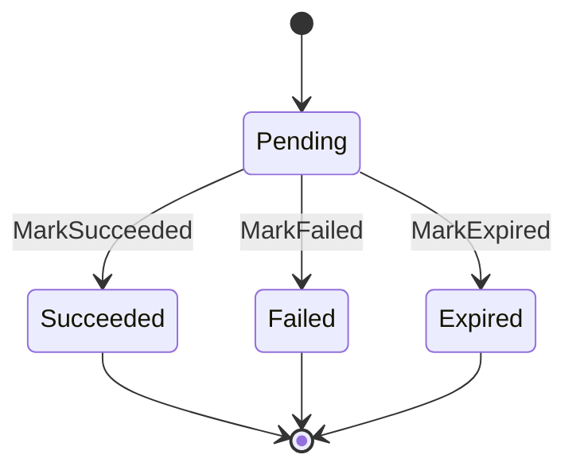
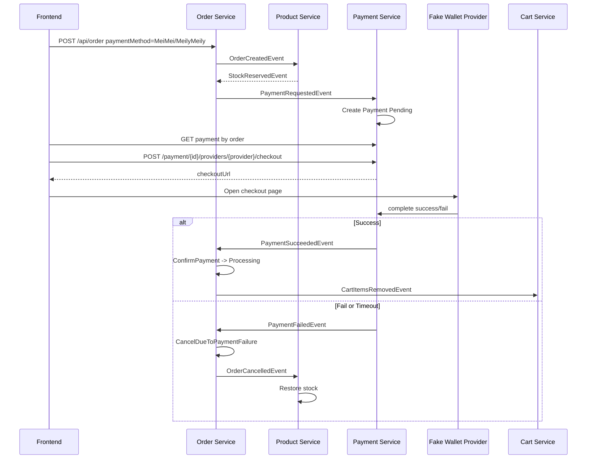
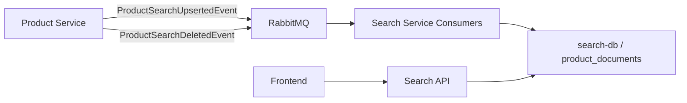

# Payment Service hiện tại và kế hoạch thêm Search Service

Tài liệu này mô tả Payment service đang hoạt động như thế nào trong hệ thống hiện tại, các event liên quan, các endpoint đang có, luồng thanh toán thực tế, những điểm nên dọn tiếp, và hướng chuẩn bị thêm Search service.

## 1. Vai trò của Payment Service

Payment service là service chịu trách nhiệm quản lý vòng đời thanh toán của order online.

Nó không tạo order, không giữ kho, không xóa cart. Những việc đó vẫn thuộc về các service khác:

- Order service tạo order và điều phối trạng thái order.
- Product service giữ kho hoặc hoàn kho.
- Cart service xóa item khỏi cart sau khi order đã đủ điều kiện.
- Payment service chỉ quản lý payment transaction và phát event kết quả thanh toán.

Payment service hiện có 3 nhiệm vụ chính:

1. Nhận yêu cầu tạo payment từ Order service.
2. Chờ user hoặc payment provider xác nhận thanh toán.
3. Publish kết quả thanh toán thành công/thất bại về hệ thống.

## 2. Cấu trúc project Payment

Payment service hiện chia thành 3 project:

```text
src/Services/Payment
├── Payment.API
├── Payment.Domain
└── Payment.Infrastructure
```

### Payment.API

Chứa API endpoints, MassTransit consumers, background jobs và cấu hình startup.

Các phần quan trọng:

- `Program.cs`: cấu hình DbContext, JWT, MassTransit, Redis idempotency, Swagger, migration.
- `Endpoints/PaymentEndpoints.cs`: định nghĩa các HTTP endpoints.
- `IntegrationEvents/Consumers/PaymentRequestedConsumer.cs`: nhận event yêu cầu tạo payment.
- `BackgroundJobs/PaymentTimeoutService.cs`: tự động expire payment pending quá lâu.
- `Templates/FakeWalletCheckout.html`: template chung cho các ví fake như MeiMei và MeilyMeily.

### Payment.Domain

Chứa domain entity và enum.

Quan trọng nhất:

- `PaymentTransaction`
- `PaymentStatus`

### Payment.Infrastructure

Chứa EF Core DbContext và migrations.

Quan trọng nhất:

- `PaymentDbContext`
- Migrations tạo bảng `Payments`, `InboxState`, `OutboxMessage`, `OutboxState`.

## 3. PaymentTransaction

Entity chính của Payment service là `PaymentTransaction`.

Các field chính:

| Field | Ý nghĩa |
|---|---|
| `Id` | Id của payment transaction |
| `OrderId` | Order mà payment này thuộc về |
| `CustomerId` | User/customer sở hữu payment |
| `Amount` | Số tiền cần thanh toán |
| `PaymentMethod` | Phương thức thanh toán, ví dụ `MeiMei`, `CreditCard`, `PayPal` |
| `Status` | Trạng thái payment |
| `ProviderTransactionId` | Mã giao dịch từ provider |
| `FailureReason` | Lý do thất bại nếu có |
| `CreatedAt` | Thời điểm tạo payment |
| `CompletedAt` | Thời điểm payment kết thúc |

## 4. PaymentStatus

Hiện có các trạng thái:

```csharp
public enum PaymentStatus
{
    Pending,
    Succeeded,
    Failed,
    Expired,
    Refunded
}
```

Ý nghĩa:

| Status | Ý nghĩa |
|---|---|
| `Pending` | Payment đã được tạo, đang chờ user/provider thanh toán |
| `Succeeded` | Payment thành công |
| `Failed` | Payment thất bại |
| `Expired` | Payment quá thời gian xử lý |
| `Refunded` | Đã hoàn tiền, hiện mới có enum, chưa có flow refund đầy đủ |

Vòng đời hiện tại:



Hiện tại entity không cho đổi từ `Failed`, `Expired`, `Succeeded` sang trạng thái khác. Đây là cách làm khá an toàn vì tránh payment bị xử lý lại sai trạng thái.

## 5. Database của Payment Service

Payment service dùng database riêng: `payment-db`.

Schema mặc định:

```text
payment
```

Bảng chính:

```text
payment.Payments
```

Ngoài ra còn có bảng của MassTransit EF outbox/inbox:

```text
payment.InboxState
payment.OutboxMessage
payment.OutboxState
```

Các index quan trọng:

| Index | Mục đích |
|---|---|
| `IX_Payments_OrderId` unique | Một order chỉ có một payment |
| `IX_Payments_CustomerId_CreatedAt` | Query payment theo customer |
| `IX_Payments_Status_CreatedAt` | Background job tìm pending/expired payment nhanh hơn |

Check constraint:

```sql
"Amount" > 0
```

## 6. Cấu hình trong Program.cs

Payment service đang cấu hình các phần sau.

### DbContext

Kết nối Postgres qua connection string:

```text
payment-db
```

Nếu không có thì fallback:

```text
DefaultConnection
```

Cuối cùng có fallback local:

```text
Host=localhost;Port=5432;Database=payment-db;Username=postgres;Password=postgres
```

EF migration history table riêng:

```csharp
npgsql.MigrationsHistoryTable("__EFMigrationsHistory_Payment", "payment");
```

Điểm này cần giữ nếu mỗi service dùng chung Postgres server nhưng schema/db riêng. Nó giúp migration history của Payment không lẫn với Order/Product.

### JWT Auth

Payment service dùng chung JWT authentication qua:

```csharp
builder.Services.AddJwtAuthentication(builder.Configuration);
```

Các endpoint user/admin cần JWT.

### MassTransit + RabbitMQ

Payment service đăng ký MassTransit:

- Consumer: `PaymentRequestedConsumer`
- Receive endpoint: `payment-requested`
- Retry: incremental 3 lần
- EF outbox/inbox: dùng `PaymentDbContext`

Ý nghĩa:

- Nếu consumer xử lý lỗi, message được retry.
- Nếu publish event trong cùng luồng xử lý với DB, outbox giúp giảm rủi ro DB save rồi message mất hoặc message phát rồi DB chưa save.
- Inbox giúp consumer idempotent hơn khi RabbitMQ redeliver message.

### Redis Idempotency

Payment service có:

```csharp
builder.Services.AddRedisIdempotency(redisConnectionString);
```

Nó dùng cho các endpoint POST gắn:

```csharp
.AddEndpointFilter<IdempotencyFilter>()
```

Mục đích:

- Client gửi `x-requestid`.
- Nếu retry cùng request, service có thể trả lại response cũ.
- Tránh tạo hoặc xác nhận payment trùng do user double click hoặc network retry.

Không nên dùng idempotency filter cho webhook thật nếu provider không gửi `x-requestid` theo format của mình.

## 7. Event contracts của Payment

File contract hiện có:

```csharp
public class PaymentRequestedEvent
{
    public Guid OrderId { get; set; }
    public Guid CustomerId { get; set; }
    public decimal Amount { get; set; }
    public string PaymentMethod { get; set; } = string.Empty;
}

public class PaymentSucceededEvent
{
    public Guid PaymentId { get; set; }
    public Guid OrderId { get; set; }
    public Guid CustomerId { get; set; }
    public decimal Amount { get; set; }
    public string PaymentMethod { get; set; } = string.Empty;
    public string ProviderTransactionId { get; set; } = string.Empty;
}

public class PaymentFailedEvent
{
    public Guid? PaymentId { get; set; }
    public Guid OrderId { get; set; }
    public Guid CustomerId { get; set; }
    public string Reason { get; set; } = string.Empty;
}
```

### PaymentRequestedEvent

Order service publish event này sau khi Product service giữ kho thành công.

Nó có nghĩa:

> Order này cần tạo một payment online.

Payment service consume event này và tạo `PaymentTransaction` trạng thái `Pending`.

### PaymentSucceededEvent

Payment service publish event này khi payment thành công.

Order service consume event này để:

- Chuyển order từ `PaymentPending` sang `Processing`.
- Publish `CartItemsRemovedEvent` để Cart service xóa sản phẩm đã đặt khỏi giỏ.

### PaymentFailedEvent

Payment service publish event này khi payment thất bại hoặc timeout.

Order service consume event này để:

- Hủy order.
- Publish `OrderCancelledEvent`.

Product service consume `OrderCancelledEvent` để restore stock.

## 8. Consumer: PaymentRequestedConsumer

Consumer này nhận `PaymentRequestedEvent`.

Luồng xử lý:

1. Lấy `OrderId` từ message.
2. Tìm payment theo `OrderId`.
3. Nếu chưa có payment thì tạo mới.
4. Nếu đã có payment thì không tạo trùng.
5. Save DB.

Pseudo-flow:

```text
PaymentRequestedEvent
    -> tìm payment theo OrderId
    -> nếu chưa có: tạo PaymentTransaction Pending
    -> nếu có rồi: bỏ qua tạo mới
    -> SaveChanges
```

Điểm tốt:

- Có unique index theo `OrderId`.
- Consumer xử lý idempotent cơ bản.
- Có try/catch log rồi throw để MassTransit retry.

## 9. Endpoint user hiện có

Base route:

```text
/api/payment
```

Các endpoint trong group này yêu cầu JWT.

### GET /api/payment/order/{orderId}

User lấy payment theo order.

Điều kiện:

- User phải login.
- Payment phải thuộc về `CustomerId` của user.

Dùng cho frontend hiển thị:

- payment status
- payment method
- provider transaction id
- failure reason

### POST /api/payment/{id}/confirm

Endpoint này hiện xác nhận payment thành công thủ công.

Hiện tại flow:

1. User gọi endpoint.
2. Service kiểm tra payment thuộc user.
3. Nếu payment `Pending`, gọi `MarkSucceeded`.
4. Publish `PaymentSucceededEvent`.
5. Save DB.

Vấn đề:

- Nó là shortcut/dev endpoint.
- Sau khi đã có fake wallet provider và webhook thật, endpoint này dễ gây nhầm.

Khuyến nghị:

- Hoặc xóa.
- Hoặc chỉ bật trong Development.
- Hoặc chuyển thành admin/dev tool.

## 10. Fake wallet providers

Payment service hiện có provider abstraction cho ví điện tử fake.

Provider đang có:

| Provider | Route key | Payment method |
|---|---|---|
| `MeiMei` | `meimei` | `MeiMei` |
| `MeilyMeily` | `meilymeily` | `MeilyMeily` |

Nó không nằm trong Angular frontend như một feature chính. Frontend chỉ gọi Payment API để lấy checkout URL.

Các class chính:

```text
Payment.API/PaymentProviders
├── IPaymentProvider.cs
├── PaymentProviderCatalog.cs
├── FakeWalletPaymentProvider.cs
├── MeiMeiPaymentProvider.cs
└── MeilyMeilyPaymentProvider.cs
```

### GET /api/payment/providers

Trả danh sách provider mà Payment service hỗ trợ.

### POST /api/payment/{id}/providers/{provider}/checkout

Frontend gọi endpoint này khi user bấm nút thanh toán.

Ví dụ:

```text
POST /api/payment/{paymentId}/providers/meimei/checkout
POST /api/payment/{paymentId}/providers/meilymeily/checkout
```

Endpoint làm:

1. Kiểm tra JWT.
2. Kiểm tra payment thuộc customer.
3. Kiểm tra payment đang `Pending`.
4. Kiểm tra payment method có khớp provider không.
5. Gọi provider tạo token HMAC bằng `Payment:WebhookSecret`.
6. Trả về checkout URL.

Response kiểu:

```json
{
  "provider": "MeiMei",
  "providerKey": "meimei",
  "paymentId": "payment-guid",
  "checkoutUrl": "http://localhost:5296/api/payment/providers/meimei/checkout/payment-guid?token=...",
  "expiresAt": "2026-05-18T..."
}
```

### GET /api/payment/providers/{provider}/checkout/{id}?token=...

Endpoint này trả về trang HTML fake wallet.

HTML nằm ở:

```text
Payment.API/Templates/FakeWalletCheckout.html
```

Trang này có 2 nút:

- `Success`
- `Fail`

### POST /api/payment/providers/{provider}/checkout/{id}/complete

Trang fake wallet gọi endpoint này khi bấm Success hoặc Fail.

Request body:

```json
{
  "success": true,
  "token": "hmac-token"
}
```

Nếu success:

```text
Pending -> Succeeded -> publish PaymentSucceededEvent
```

Nếu fail:

```text
Pending -> Failed -> publish PaymentFailedEvent
```

Nếu payment quá 10 phút:

```text
Pending -> Expired -> publish PaymentFailedEvent
```

### Vì sao fake wallet dùng token?

Vì endpoint checkout là anonymous. Nếu không có token, ai biết `PaymentId` cũng có thể gọi complete để đánh dấu thanh toán thành công/thất bại.

Token hiện được tính bằng HMAC:

```text
HMAC(secret, "{providerRoute}:{paymentId}")
```

Đây là mức đủ tốt cho fake provider/local testing.

Với provider thật, mình sẽ không dùng token kiểu này mà dùng webhook signature của provider.

## 11. Webhook thật

Endpoint:

```text
POST /api/payment/webhook
```

Endpoint này anonymous vì provider bên ngoài không có JWT user.

Để bảo vệ, nó dùng HMAC signature:

Header:

```text
x-payment-timestamp
x-payment-signature
```

Payload được ký theo dạng:

```text
{timestamp}.{raw_body}
```

Service kiểm tra:

1. Có timestamp không.
2. Có signature không.
3. Timestamp có nằm trong khoảng cho phép 5 phút không.
4. Signature có khớp HMAC SHA256 không.
5. So sánh bằng `CryptographicOperations.FixedTimeEquals`.

Mục đích:

- Chống giả mạo webhook.
- Chống replay request quá cũ.
- Không phụ thuộc JWT.

## 12. Admin payment endpoints

Admin group:

```text
/api/payment/admin
```

Yêu cầu:

- Login.
- Role admin.

### GET /api/payment/admin

Lấy danh sách payment có paging/filter.

Query hỗ trợ:

- `pageIndex`
- `pageSize`
- `orderId`
- `customerId`
- `status`

Dùng cho màn admin xem payment list.

### GET /api/payment/admin/{id}

Admin xem chi tiết một payment.

### POST /api/payment/admin/{id}/mock-webhook

Admin giả lập webhook success/fail.

Endpoint này có idempotency filter.

Nó giống dev tool để test flow mà không cần mở trang MeiMei.

## 13. PaymentTimeoutService

Background service chạy mỗi 1 phút.

Nó tìm payment:

```text
Status == Pending
CreatedAt < UtcNow - 10 minutes
```

Mỗi lần lấy tối đa 100 payment.

Với mỗi payment quá hạn:

1. `MarkExpired("Thanh toán quá thời gian xử lý.")`
2. Publish `PaymentFailedEvent`
3. Save DB

Tác dụng:

- User mở checkout nhưng không thanh toán.
- Payment không bị pending mãi.
- Order được hủy.
- Product được restore stock.

## 14. Luồng online payment đầy đủ



## 15. COD flow khác online payment thế nào?

COD không cần Payment service.

Luồng COD:

```text
OrderCreatedEvent
-> Product giữ kho
-> StockReservedEvent
-> Order chuyển Processing
-> CartItemsRemovedEvent
```

Luồng online:

```text
OrderCreatedEvent
-> Product giữ kho
-> StockReservedEvent
-> Order chuyển PaymentPending
-> PaymentRequestedEvent
-> Payment Pending
-> User/provider xác nhận
-> PaymentSucceededEvent hoặc PaymentFailedEvent
```

## 16. Outbox/Inbox trong Payment service

Payment service dùng EF outbox/inbox của MassTransit.

### Inbox

Giúp consumer xử lý message an toàn hơn khi RabbitMQ redeliver.

Ví dụ:

```text
PaymentRequestedEvent được gửi lại
-> Consumer kiểm tra InboxState
-> Tránh xử lý trùng không kiểm soát
```

### Outbox

Giúp publish event gắn với transaction DB.

Ví dụ:

```text
Payment MarkSucceeded
Publish PaymentSucceededEvent
SaveChanges
```

Với bus outbox, event không bị xem là gửi thành công độc lập hoàn toàn với DB save.

Đây là phần quan trọng trong saga/event-driven architecture.

## 17. Redis idempotency trong Payment service

Redis idempotency dùng cho request từ client/admin.

Ví dụ user double click `Pay with MeiMei` hoặc `Pay with MeilyMeily`:

```text
Request 1: POST /payment/{id}/providers/{provider}/checkout x-requestid=abc
Request 2: POST /payment/{id}/providers/{provider}/checkout x-requestid=abc
```

Service có thể trả cùng response, tránh xử lý lặp.

Nó khác với inbox/outbox:

| Cơ chế | Dùng cho | Mục đích |
|---|---|---|
| Redis idempotency | HTTP request từ client | Chống double click/retry cùng request |
| Inbox | Message consumer | Chống consume trùng |
| Outbox | Publish message | Đảm bảo publish event bền hơn |

## 18. Những điểm nên dọn tiếp trong Payment

### 18.1. Xử lý `/confirm`

Hiện `/confirm` auto success.

Nên chọn một trong các hướng:

1. Xóa endpoint này.
2. Chỉ bật ở Development.
3. Đổi route thành `/dev/confirm`.
4. Chỉ cho admin gọi.

Khuyến nghị:

> Sau khi fake wallet providers đã hoạt động, nên bỏ khỏi flow user bình thường.

### 18.2. Refund chưa có flow thật

`PaymentStatus.Refunded` đã tồn tại nhưng chưa có:

- Refund request.
- Refund consumer.
- Refund event.
- Liên kết với return order.

Nếu muốn làm đầy đủ sau này, nên thêm:

```csharp
public class PaymentRefundRequestedEvent
{
    public Guid PaymentId { get; set; }
    public Guid OrderId { get; set; }
    public Guid CustomerId { get; set; }
    public string Reason { get; set; } = string.Empty;
}

public class PaymentRefundedEvent
{
    public Guid PaymentId { get; set; }
    public Guid OrderId { get; set; }
    public Guid CustomerId { get; set; }
    public decimal Amount { get; set; }
    public string ProviderRefundId { get; set; } = string.Empty;
}
```

### 18.3. Provider abstraction

Phần fake wallet hiện đã được tách khỏi `PaymentEndpoints`.

Code hiện tại:

```text
PaymentProviders
├── IPaymentProvider
├── PaymentProviderCatalog
├── FakeWalletPaymentProvider
├── MeiMeiPaymentProvider
└── MeilyMeilyPaymentProvider
```

Endpoint chỉ còn nhiệm vụ:

1. Tìm provider theo route key.
2. Kiểm tra payment thuộc user.
3. Gọi provider tạo checkout page/complete result.
4. Dựa trên provider result để mark payment và publish event.

Interface hiện tại:

```csharp
public interface IPaymentProvider
{
    string Name { get; }
    string RouteName { get; }

    bool SupportsPaymentMethod(string paymentMethod);

    Task<PaymentCheckoutResult> CreateCheckoutAsync(
        PaymentTransaction payment,
        HttpRequest request,
        CancellationToken cancellationToken);

    Task<PaymentCheckoutPageResult> CreateCheckoutPageAsync(
        PaymentTransaction payment,
        string? token,
        CancellationToken cancellationToken);

    PaymentProviderResult CompleteCheckout(
        PaymentTransaction payment,
        PaymentProviderCompleteRequest request);
}
```

Khi thêm provider thật như Stripe/PayPal, có thể thêm class mới theo pattern này hoặc tách thêm interface riêng cho real webhook parser.

## 19. Chuẩn bị thêm Search Service

Search service nên là service riêng, có database/index riêng.

Không nên để frontend search bằng cách gọi Product service rồi filter trong client, vì:

- Data lớn sẽ chậm.
- Product service sẽ bị ôm thêm trách nhiệm search/ranking/filter.
- Search có thể cần index riêng.
- Sau này đổi engine khó.

## 20. Search Service nên làm nhiệm vụ gì?

Search service nên chịu trách nhiệm:

- Search product theo keyword.
- Filter theo category.
- Filter theo stock.
- Filter theo price.
- Sort theo relevance, price, newest.
- Paging.
- Trả kết quả tối ưu cho frontend.

Không nên chịu trách nhiệm:

- Tạo product.
- Update product gốc.
- Trừ kho.
- Quản lý category gốc.

Search service chỉ giữ bản sao phục vụ đọc/search.

## 21. Kiến trúc Search đề xuất



Search service là read model/projection.

Product service vẫn là source of truth.

## 22. Vì sao Search nên nghe event thay vì query Product DB?

Nếu Search query thẳng Product DB:

- Coupling giữa Search và Product DB tăng.
- Product đổi schema thì Search dễ hỏng.
- Search có thể gây load lên Product DB.
- Không đúng tinh thần microservice database per service.

Nếu Search nghe event:

- Search có database riêng.
- Product publish sự kiện khi dữ liệu thay đổi.
- Search tự cập nhật index.
- Hệ thống chấp nhận eventual consistency.

Eventual consistency nghĩa là:

> Product vừa update xong, Search có thể chậm vài mili giây hoặc vài giây mới thấy thay đổi.

Với search product, điều này chấp nhận được.

## 23. Product events hiện tại chưa đủ cho Search

Hiện `ProductEvents.cs` đang có:

```csharp
public record CreateProductRequest(...);
public record UpdateProductRequest(Guid Id, int CategoryId);
public record DeleteProductRequest(Guid Id);
```

Đây là command/request, chưa phải event fact.

Nghĩa của chúng là:

```text
Hãy tạo/sửa/xóa product
```

Search service không nên consume command này, vì command chưa chắc đã thành công.

Search service nên consume event sau khi Product service đã xử lý thành công.

## 24. Event nên thêm cho Search

Nên thêm:

```csharp
public record ProductSearchUpsertedEvent(
    Guid Id,
    string Name,
    decimal Price,
    int StockQuantity,
    int CategoryId,
    string CategoryName,
    string? Description,
    string? ImageUrl,
    bool IsActive,
    DateTime UpdatedAt);

public record ProductSearchDeletedEvent(
    Guid Id,
    DateTime DeletedAt);
```

Tên `Upserted` nghĩa là:

- Product mới tạo thì insert vào search index.
- Product update thì update search index.

Tại sao không tách Created/Updated?

Tách cũng được. Nhưng Search thường chỉ cần biết:

```text
Đây là trạng thái mới nhất của product, hãy ghi đè vào index.
```

Nên `Upserted` đơn giản hơn.

## 25. Search database đề xuất

Ban đầu nên dùng Postgres trước.

Lý do:

- Project đã có Postgres.
- AppHost đã có pattern add database.
- Không thêm infra mới.
- EF Core migration quen thuộc.
- Postgres có full-text search đủ dùng cho giai đoạn đầu.

Database:

```text
search-db
```

Schema:

```text
search
```

Bảng:

```text
search.ProductDocuments
```

Entity đề xuất:

```csharp
public class ProductDocument
{
    public Guid Id { get; set; }
    public string Name { get; set; } = string.Empty;
    public string NormalizedName { get; set; } = string.Empty;
    public decimal Price { get; set; }
    public int StockQuantity { get; set; }
    public int CategoryId { get; set; }
    public string CategoryName { get; set; } = string.Empty;
    public string? Description { get; set; }
    public string? ImageUrl { get; set; }
    public bool IsActive { get; set; }
    public DateTime UpdatedAt { get; set; }
}
```

Index đề xuất:

| Index | Mục đích |
|---|---|
| `Id` primary key | Upsert nhanh |
| `NormalizedName` | Search cơ bản |
| `CategoryId` | Filter category |
| `Price` | Filter/sort price |
| `StockQuantity` | Filter in-stock |
| `IsActive` | Chỉ show active product |

Giai đoạn đầu có thể search bằng:

```csharp
p.NormalizedName.Contains(normalizedQuery)
```

Sau đó nâng lên Postgres full-text search.

## 26. Search API đề xuất

Endpoint:

```text
GET /api/search/products
```

Query:

| Query | Ý nghĩa |
|---|---|
| `q` | Keyword |
| `categoryId` | Filter theo category |
| `minPrice` | Giá thấp nhất |
| `maxPrice` | Giá cao nhất |
| `inStock` | Chỉ lấy sản phẩm còn hàng |
| `sort` | `relevance`, `priceAsc`, `priceDesc`, `nameAsc`, `newest` |
| `pageIndex` | Trang hiện tại |
| `pageSize` | Số item mỗi trang |

Response:

```csharp
public record SearchProductsResponse(
    IReadOnlyList<SearchProductItem> Items,
    int TotalCount,
    int PageIndex,
    int PageSize);

public record SearchProductItem(
    Guid Id,
    string Name,
    decimal Price,
    int StockQuantity,
    int CategoryId,
    string CategoryName,
    string? Description,
    string? ImageUrl);
```

Ví dụ request:

```text
GET /api/search/products?q=shirt&categoryId=2&inStock=true&pageIndex=0&pageSize=20
```

## 27. Search service project structure đề xuất

```text
src/Services/Search
├── Search.API
├── Search.Domain
└── Search.Infrastructure
```

### Search.API

Chứa:

- Program.cs
- Search endpoints
- Product event consumers

### Search.Domain

Chứa:

- ProductDocument entity
- Enum hoặc value object nếu cần

### Search.Infrastructure

Chứa:

- SearchDbContext
- Migrations

## 28. Search service MassTransit

Search service cần consume:

```text
product-search-upserted
product-search-deleted
```

Consumer:

```text
ProductSearchUpsertedConsumer
ProductSearchDeletedConsumer
```

Upsert flow:

```text
ProductSearchUpsertedEvent
-> tìm ProductDocument theo Id
-> nếu chưa có thì insert
-> nếu có thì update toàn bộ field
-> SaveChanges
```

Delete flow:

```text
ProductSearchDeletedEvent
-> tìm ProductDocument theo Id
-> nếu có thì xóa hoặc set IsActive = false
-> SaveChanges
```

Khuyến nghị:

> Với search index, nên soft delete bằng `IsActive = false`, vì giữ lại document giúp debug và có thể restore.

## 29. Product service cần sửa gì để cấp data cho Search?

Sau khi Product service tạo product thành công:

```text
ProductCreationConsumer
-> Save product
-> Publish ProductSearchUpsertedEvent
```

Sau khi Product service update product thành công:

```text
ProductUpdateConsumer
-> Save update
-> Load product + category
-> Publish ProductSearchUpsertedEvent
```

Sau khi Product service delete product thành công:

```text
ProductDeleteConsumer
-> Soft delete product
-> Publish ProductSearchDeletedEvent
```

Quan trọng:

> Publish search event sau khi product thay đổi thành công, không publish ngay từ endpoint request.

Vì endpoint chỉ gửi command vào MQ, chưa chắc product đã được tạo/sửa/xóa thành công.

## 30. AppHost cần thêm gì?

Thêm database:

```csharp
var searchDb = postgres.AddDatabase("search-db");
```

Thêm project:

```csharp
builder.AddProject<Search_API>("search-api")
    .WithReference(searchDb)
    .WithReference(rabbitmq)
    .WithReference(redis)
    .WaitFor(searchDb)
    .WaitFor(rabbitmq)
    .WaitFor(redis);
```

Redis có thể chưa cần cho Search nếu chỉ GET endpoint. Nhưng nếu Search sau này có admin reindex endpoint POST thì có thể dùng idempotency.

## 31. Frontend cần sửa gì?

Hiện frontend đang gọi Product API để lấy toàn bộ product rồi filter/sort ở client.

Khi có Search service, frontend nên đổi:

```text
GET Product API /api/products
```

sang:

```text
GET Search API /api/search/products
```

Product API vẫn có thể dùng để:

- Admin tạo/sửa/xóa product.
- Lấy detail product nếu cần source-of-truth.
- Lấy categories nếu Search chưa expose category facet.

Frontend nên thêm config:

```ts
search: 'http://localhost:xxxx'
```

Hoặc nếu muốn gọn, có thể tạm dùng Product API cho category và Search API cho list product.

## 32. Thứ tự triển khai Search Service

Thứ tự nên làm:

1. Thêm event contract `ProductSearchUpsertedEvent`, `ProductSearchDeletedEvent`.
2. Tạo project `Search.Domain`, `Search.Infrastructure`, `Search.API`.
3. Tạo `SearchDbContext` và `ProductDocument`.
4. Add migration cho Search.
5. Cấu hình AppHost thêm `search-db` và `search-api`.
6. Cấu hình MassTransit trong Search API.
7. Viết consumer upsert/delete.
8. Sửa Product consumers publish search events sau khi xử lý thành công.
9. Viết endpoint `GET /api/search/products`.
10. Build toàn solution.
11. Sửa frontend gọi Search API.
12. Test flow tạo product -> search thấy product.

## 33. Luồng test Search sau khi làm xong

```text
Admin tạo product
-> Product endpoint publish CreateProductRequest
-> ProductCreationConsumer tạo product trong product-db
-> Product service publish ProductSearchUpsertedEvent
-> Search service consume event
-> Search ghi ProductDocument vào search-db
-> Frontend search keyword
-> Search API trả product
```

Update category:

```text
Admin đổi category product
-> ProductUpdateConsumer update product-db
-> Product publish ProductSearchUpsertedEvent
-> Search update ProductDocument
```

Delete product:

```text
Admin xóa product
-> ProductDeleteConsumer soft delete product-db
-> Product publish ProductSearchDeletedEvent
-> Search set IsActive = false
```

## 34. Rủi ro cần nhớ khi thêm Search

### Eventual consistency

Search có thể chậm hơn Product DB một chút.

Ví dụ:

```text
Product vừa tạo xong
-> frontend search ngay lập tức
-> có thể chưa thấy trong 1-2 giây
```

Đây là bình thường trong event-driven system.

### Rebuild index

Nếu Search DB bị xóa hoặc consumer lỗi lâu ngày, cần cách rebuild index.

Nên chuẩn bị sau:

```text
POST /api/search/admin/reindex
```

Endpoint này có thể:

- Gọi Product API để lấy toàn bộ active product.
- Hoặc Product service publish lại toàn bộ `ProductSearchUpsertedEvent`.

Giai đoạn đầu chưa cần làm ngay, nhưng nên ghi vào backlog.

### Duplicate events

RabbitMQ/MassTransit có thể gửi lại event.

Consumer Search phải idempotent:

- Upsert theo `ProductId`.
- Delete nếu đã delete thì bỏ qua.

### Ordering

Có thể xảy ra:

```text
Update event đến sau Delete event
```

Muốn xử lý chắc hơn, event nên có `UpdatedAt` hoặc version.

Search consumer chỉ apply event nếu event mới hơn document hiện tại.

## 35. Kết luận hướng đi

Payment service hiện đã có nền tảng tương đối đúng cho saga/event-driven:

- Payment DB riêng.
- Payment status rõ.
- Consumer tạo pending payment.
- Fake wallet providers `MeiMei` và `MeilyMeily` để test flow provider.
- Webhook có HMAC.
- Timeout job.
- Payment success/fail event.
- Redis idempotency cho client POST.
- EF outbox/inbox cho message reliability.

Search service nên làm tiếp theo theo hướng read model riêng:

- Product service là source of truth.
- Search service consume product fact events.
- Search DB/index riêng.
- Frontend query Search API thay vì load toàn bộ product rồi filter client-side.

Hướng triển khai thực tế nên bắt đầu bằng Postgres search trước để không làm project phình quá sớm. Khi data lớn hoặc cần ranking/fuzzy search tốt hơn, có thể đổi backend search sang Meilisearch/OpenSearch mà vẫn giữ API và event flow gần như cũ.
