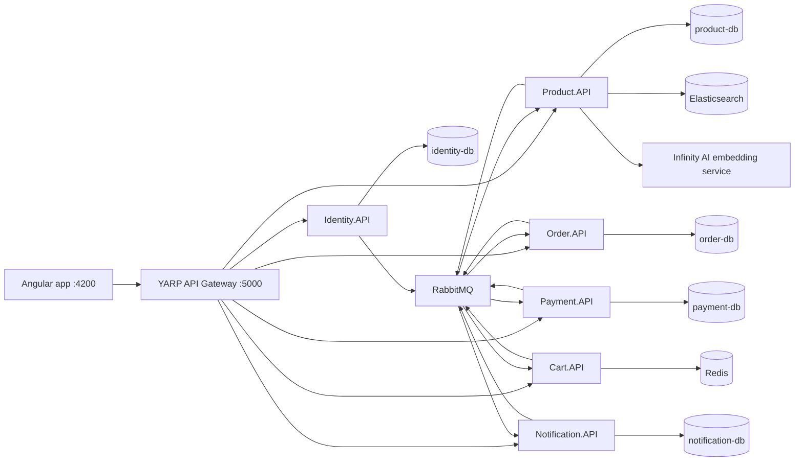

# Shopping Web Project Handbook

Last updated: 2026-06-01

This document is the "where are we now?" map for the repository. It explains what the project currently contains, how the pieces fit together, what is already tested, and what is still missing before calling it production-ready.

## 1. Big Picture

`shopping-web` is a microservice-based e-commerce application.

It currently includes:

- A .NET Aspire local orchestration host.
- A YARP API gateway.
- Six backend services: Identity, Product, Cart, Order, Payment, Notification.
- Angular storefront/admin frontend.
- PostgreSQL databases per service.
- Redis for cart/idempotency.
- RabbitMQ and MassTransit for async workflows.
- Elasticsearch plus an embedding service for product search.
- Dockerfiles for APIs and frontend.
- GitHub Actions CI.
- Backend API tests, integration tests, Testcontainers tests, saga harness tests, Angular tests, Playwright E2E, and k6 scripts.

The system is no longer a simple CRUD app. It is closer to a small distributed commerce platform.

## 2. Repository Map

```text
AppHost/                         .NET Aspire orchestration
ServiceDefault/                  Shared API defaults: auth, CORS, health, rate limit, OTEL
src/BuildingBlocks/EventBus/     Shared contracts, endpoint helpers, filters, migration helpers
src/Gateways/ApiGateway/         YARP reverse proxy gateway
src/Services/Identity/           Auth, users, refresh tokens
src/Services/Product/            Catalog, stock, Elasticsearch sync/search
src/Services/Cart/               Redis cart API and cart message consumer
src/Services/Order/              Order domain, order API, MassTransit saga
src/Services/Payment/            Payment transactions, providers, webhook/checkout
src/Services/Notification/       Notification storage and event consumers
src/Tools/DbSeeder/              Fake data generator/seeder
src/Web/web-store-angular/       Angular frontend
tests/Order.FlowTests/           Order domain and saga tests
tests/Identity.ApiTests/         Identity API integration tests
tests/Payment.ApiTests/          Payment API integration tests
tests/Service.IntegrationTests/  Redis, notification, Elastic, provider integration tests
docker/                          Shared .NET service Dockerfile
perf/                            k6 performance/load scripts
docs/                            Project documentation
```

## 3. Runtime Architecture



## 4. Technology Stack

Backend:

- .NET 10
- ASP.NET Core Minimal APIs
- Entity Framework Core 10
- PostgreSQL
- MassTransit 8.3.3
- RabbitMQ
- Redis
- Elasticsearch
- OpenTelemetry
- YARP reverse proxy
- .NET Aspire

Frontend:

- Angular 21
- TypeScript 5.9
- Playwright
- Karma/Jasmine
- Nginx production image

Testing and tooling:

- xUnit
- Shouldly
- Testcontainers
- WebApplicationFactory
- MassTransit test harness
- Playwright
- k6
- GitHub Actions
- Docker Buildx

## 5. Aspire AppHost

Main file:

```text
AppHost/Program.cs
```

Aspire starts:

- PostgreSQL with pgAdmin on `5050`.
- RabbitMQ with management UI on `15672`.
- Redis.
- Elasticsearch.
- Infinity AI container for embeddings.
- All .NET services.
- API Gateway on `5000`.
- Angular dev app on `4200`.

The embedding service defaults to CPU:

```powershell
dotnet run --project AppHost\AppHost.csproj
```

CUDA can be requested explicitly:

```powershell
dotnet run --project AppHost\AppHost.csproj --Parameters:infinity-ai-device=cuda
```

This was changed so a non-NVIDIA machine can still run the full stack.

## 6. API Gateway

Main files:

```text
src/Gateways/ApiGateway/Program.cs
src/Gateways/ApiGateway/appsettings.json
```

Gateway technology:

- YARP Reverse Proxy.
- Aspire service discovery.
- Shared API defaults.
- CORS and security headers.
- Health endpoints.

Routes:

```text
/api/auth/**           -> Identity.API
/api/products/**       -> Product.API
/api/cart/**           -> Cart.API
/api/order/**          -> Order.API
/api/payment/**        -> Payment.API
/api/notifications/**  -> Notification.API
```

Gateway also strips and resets selected forwarded headers:

- Removes `Origin`.
- Removes stale `X-Forwarded-Host`.
- Removes stale `X-Forwarded-Proto`.
- Re-adds forwarded host/proto from the incoming request.

## 7. Shared Building Blocks

Main directories:

```text
ServiceDefault/
src/BuildingBlocks/EventBus/
src/BuildingBlocks/Build/
```

`ServiceDefault` provides shared API defaults:

- OpenTelemetry logging, metrics, tracing.
- ProblemDetails.
- HTTP logging.
- Health endpoints:
  - `/health`
  - `/health/live`
  - `/health/ready`
- CORS:
  - Development allows any origin.
  - Production requires `Cors:AllowedOrigins`.
- Global fixed-window rate limiting.
- Security headers:
  - `X-Content-Type-Options: nosniff`
  - `X-Frame-Options: DENY`
  - `Referrer-Policy: no-referrer`
  - `Permissions-Policy`
- JWT bearer validation using RSA public key.
- Development-only Swagger/OpenAPI and Scalar UI.

`EventBus` contains:

- Shared event/command contracts:
  - `OrderEvents.cs`
  - `StockEvents.cs`
  - `PaymentEvents.cs`
  - `ProductEvents.cs`
  - `CartEvents.cs`
  - `IdentityEvents.cs`
- Endpoint helpers:
  - Extract customer id from JWT.
  - Admin authorization policy.
  - Vietnamese normalization helper.
- Filters:
  - FluentValidation endpoint filter.
  - Idempotency endpoint filter backed by Redis.
- EF migration helper.

`ServicePackages.props` centralizes common package references for API and infrastructure projects.

## 8. Identity Service

Main files:

```text
src/Services/Identity/Identity.API/
src/Services/Identity/Identity.Domain/
src/Services/Identity/Identity.Infrastructure/
```

Responsibilities:

- User registration.
- Login by email or phone.
- JWT creation using RSA private key.
- Refresh token rotation.
- Logout.
- Session listing.
- Session revocation.
- Customer profile change event publication.

Important endpoints:

```text
POST   /api/auth/register
POST   /api/auth/login
POST   /api/auth/refresh
POST   /api/auth/logout
GET    /api/auth/sessions
DELETE /api/auth/sessions/{sessionId}
```

Data:

- `Customer`
- `RefreshToken`
- ASP.NET Identity tables

Events published:

- `CustomerProfileChangedEvent`

Security notes:

- Refresh tokens are hashed with SHA-256 before storage.
- Access tokens are signed with RSA.
- Production must configure JWT key material from secrets, not source-controlled JSON.

## 9. Product Service

Main files:

```text
src/Services/Product/Product.API/
src/Services/Product/Product.Domain/
src/Services/Product/Product.Infrastructure/
```

Responsibilities:

- Product catalog.
- Category management.
- Admin product create/update/delete via asynchronous commands.
- Stock reservation/release for orders.
- Elasticsearch indexing.
- Hybrid product search with database fallback.

Important endpoints:

```text
GET    /api/products
GET    /api/products/categories
GET    /api/products/{id}
GET    /api/products/search
POST   /api/products
PUT    /api/products/{productId}
DELETE /api/products/{id}
POST   /api/products/categories
```

Public product endpoints are readable without auth. Admin mutations require admin authorization.

Domain/data:

- `Product`
- `Category`
- `StockReservation`

Events/commands consumed:

- `CreateProductRequest`
- `UpdateProductRequest`
- `DeleteProductRequest`
- `ReserveStockCommand`
- `ReleaseStockCommand`

Events published:

- `ProductCreatedEvent`
- `ProductUpdatedEvent`
- `ProductDeletedEvent`
- `StockReservedEvent`
- `StockReservationFailedEvent`
- `StockReleasedEvent`

### Product Search

The search code used to live directly inside the endpoint. It is now split into small internal components:

```text
src/Services/Product/Product.API/Search/ProductSearchContracts.cs
src/Services/Product/Product.API/Search/ProductSearchService.cs
src/Services/Product/Product.API/Search/ProductElasticSearch.cs
src/Services/Product/Product.API/Search/ProductDatabaseSearch.cs
src/Services/Product/Product.API/Search/ProductSearchCategoryResolver.cs
src/Services/Product/Product.API/Search/ProductSearchFilters.cs
src/Services/Product/Product.API/Search/ProductSearchOptions.cs
```

`ProductSearchService` is the coordinator. It decides whether to use Elasticsearch or the database fallback. The Elastic query, database query, category inference, shared filter/sort rules, and search options live in separate files so the endpoint and the orchestration layer stay small.

Current behavior:

- Empty keyword always uses database catalog search.
- Non-empty keyword follows `ProductSearch:Mode`:
  - `Hybrid`: try Elasticsearch, then fallback to PostgreSQL.
  - `Database`: use PostgreSQL only.
  - `Elastic`: require Elasticsearch.
- Search combines:
  - BM25/multi-match against name/category.
  - Optional vector search using Infinity AI embeddings.
  - Category inference from keyword.
  - Stock filter.
  - Sort by price or name.
- Elasticsearch search has a short timeout so slow embedding/index calls do not make the web UI hang.
- Elasticsearch index setup/rebuild runs as a background hosted service. Product catalog endpoints are available even while Elastic indexing is still running.

Why Product Search is not a separate microservice yet:

- Search still depends heavily on Product DB, categories, stock fields, and Product ownership.
- The current best boundary is an internal application service (`IProductSearchService`) inside Product.API.
- Splitting into a standalone Search service becomes useful only when search needs independent scaling, independent deployments, or separate ownership.

### Elasticsearch Index

Main files:

```text
src/Services/Product/Product.API/IntegrationEvents/Consumers/Elastic/ElasticProductIndex.cs
src/Services/Product/Product.API/IntegrationEvents/Consumers/Elastic/ElasticConfiguration.cs
src/Services/Product/Product.API/IntegrationEvents/Consumers/Elastic/ProductEsDocument.cs
```

Current index setup:

```text
alias: products
versioned index: products-v385
embedding dimensions: 384
```

Document fields include:

- `id`
- `name`
- `nameSort`
- `categoryName`
- `categoryId`
- `isActive`
- `stockQuantity`
- `stockStatus`
- `price`
- `description`
- `imageUrl`
- `nameEmbeddingVector`

Important fix already made:

- Zero-magnitude vectors are skipped because Elasticsearch cosine similarity rejects all-zero vectors.
- Wrong-dimension vectors are also skipped.

## 10. Cart Service

Main files:

```text
src/Services/Cart/Cart.API/
```

Responsibilities:

- User cart stored in Redis.
- Add/update/remove/clear cart items.
- Remove cart items after successful order/payment flow.

Important endpoints:

```text
GET    /api/cart
POST   /api/cart/items
PUT    /api/cart/items/{productId}
DELETE /api/cart/items/{productId}
DELETE /api/cart/clear
```

All cart endpoints require authentication.

Data store:

- Redis

Events/commands consumed:

- `RemoveCartItemsCommand`

## 11. Order Service

Main files:

```text
src/Services/Order/Order.API/
src/Services/Order/Order.Domain/
src/Services/Order/Order.Infrastructure/
```

Responsibilities:

- Create orders.
- Customer order history.
- Admin order management.
- Shipping/delivery/return workflow.
- MassTransit saga for stock and payment orchestration.
- Order timeline.

Important endpoints:

```text
POST /api/order
GET  /api/order
GET  /api/order/{id}
PUT  /api/order/{id}/cancel
PUT  /api/order/{id}/return-request

GET  /api/order/admin
GET  /api/order/admin/{id}
PUT  /api/order/{id}/ship
PUT  /api/order/{id}/deliver
PUT  /api/order/{id}/return-approve
PUT  /api/order/{id}/return-reject
```

Domain/data:

- `Order`
- `OrderDetail`
- `DeliveryInfo`
- `OrderTimelineEvent`
- `OrderSagaInstance`

Order statuses:

```text
Pending
PaymentPending
Processing
Shipped
Delivered
ReturnRequested
Returned
ReturnRejected
Cancelled
```

Payment method enum:

```text
COD
MeiMei
MeilyMeily
CreditCard
PayPal
```

### Order Saga

Main file:

```text
src/Services/Order/Order.API/Saga/OrderStateMachine.cs
```

Saga states:

```text
Submitted
StockReserving
PaymentCreating
PaymentPending
Cancelling
Finalized
```

Current important flows:

```text
OrderSubmitted
  -> ReserveStockCommand
  -> StockReserving

StockReserved + COD
  -> order Processing
  -> RemoveCartItemsCommand
  -> Finalized

StockReserved + online payment
  -> order PaymentPending
  -> CreatePaymentCommand
  -> PaymentCreating

PaymentCreated
  -> PaymentPending

PaymentSucceeded
  -> order Processing
  -> RemoveCartItemsCommand
  -> Finalized

PaymentFailed
  -> order Cancelled
  -> ReleaseStockCommand
  -> Cancelling

CancelOrderCommand
  -> compensation depending on state

PaymentRefunded while Cancelling
  -> ReleaseStockCommand
```

Recent correction:

- Saga events with `CorrelationId` now correlate by `Message.CorrelationId`.
- Timeout events still correlate by `OrderId` because their contracts only carry `OrderId`.

## 12. Payment Service

Main files:

```text
src/Services/Payment/Payment.API/
src/Services/Payment/Payment.Domain/
src/Services/Payment/Payment.Infrastructure/
```

Responsibilities:

- Create payment transactions in response to order saga command.
- Return payment status by order.
- Provide payment providers.
- Checkout page flow.
- Signed webhook endpoint.
- Admin mock webhook.
- Payment timeout background service.
- Cancel/refund behavior.

Important endpoints:

```text
GET  /api/payment/order/{orderId}
GET  /api/payment/providers
POST /api/payment/{id}/providers/{provider}/checkout
GET  /api/payment/providers/{provider}/checkout/{id}
POST /api/payment/providers/{provider}/checkout/{id}/complete
POST /api/payment/webhook

GET  /api/payment/admin
GET  /api/payment/admin/{id}
POST /api/payment/admin/{id}/mock-webhook
```

Providers:

- Fake wallet base provider.
- MeiMei provider.
- MeilyMeily provider.

Events/commands consumed:

- `CreatePaymentCommand`
- `CancelPaymentCommand`

Events published:

- `PaymentCreatedEvent`
- `PaymentSucceededEvent`
- `PaymentFailedEvent`
- `PaymentRefundedEvent`

Security:

- Webhook signature uses HMAC SHA-256.
- Requires:
  - `x-payment-signature`
  - `x-payment-timestamp`
- Rejects signatures outside a 5-minute clock tolerance.
- Production startup fails if webhook secret is missing.

## 13. Notification Service

Main files:

```text
src/Services/Notification/Notification.API/
src/Services/Notification/Notification.Domain/
src/Services/Notification/Notification.Infrastructure/
```

Responsibilities:

- Store notifications.
- Query customer notifications.
- Mark notification read.
- Mark all read.
- Admin notification query.
- Consume order/customer events.

Important endpoints:

```text
GET /api/notifications
GET /api/notifications/unread-count
PUT /api/notifications/{id}/read
PUT /api/notifications/read-all
GET /api/notifications/admin
```

Events consumed:

- `OrderStatusChangedEvent`
- `CustomerProfileChangedEvent`

Data:

- `NotificationMessage`
- `NotificationRecipient`

## 14. Angular Frontend

Main directory:

```text
src/Web/web-store-angular/
```

Technology:

- Angular 21
- Standalone app style
- Karma/Jasmine tests
- Playwright E2E
- Docker + Nginx production image

Scripts:

```powershell
npm start
npm run build
npm test -- --watch=false --browsers=ChromeHeadless
npm run e2e
npm audit --audit-level=high
```

Runtime API config:

```text
src/Web/web-store-angular/public/env.js
```

The production image serves `/env.js`, so deployment can configure the API gateway URL without rebuilding the Angular app.

Known frontend coverage:

- Angular build passes.
- Karma/Jasmine unit/component tests exist.
- Playwright covers storefront smoke and key workflows:
  - login
  - browse product
  - add cart
  - COD checkout
  - online checkout
  - admin ship/deliver

## 15. Message Contracts

Main directory:

```text
src/BuildingBlocks/EventBus/Contracts/
```

Important contracts by domain:

Identity:

- `CustomerProfileChangedEvent`

Product/catalog:

- `CreateProductRequest`
- `UpdateProductRequest`
- `DeleteProductRequest`
- `ProductCreatedEvent`
- `ProductUpdatedEvent`
- `ProductDeletedEvent`
- `SearchProductRequest`

Cart:

- `RemoveCartItemsCommand`

Order:

- `OrderSubmittedEvent`
- `OrderStatusChangedEvent`
- `CancelOrderCommand`
- `StockTimeoutExpired`
- `PaymentTimeoutExpired`

Stock:

- `ReserveStockCommand`
- `ReleaseStockCommand`
- `StockReservedEvent`
- `StockReservationFailedEvent`
- `StockReleasedEvent`

Payment:

- `CreatePaymentCommand`
- `CancelPaymentCommand`
- `PaymentCreatedEvent`
- `PaymentSucceededEvent`
- `PaymentFailedEvent`
- `PaymentRefundedEvent`

## 16. Important Workflows

### Registration/Login

```text
Frontend
  -> Gateway
  -> Identity.API
  -> identity-db
  -> JWT + refresh token
  -> CustomerProfileChangedEvent
  -> Notification.API consumer
```

### Browse and Search Products

```text
Frontend
  -> Gateway
  -> Product.API
  -> ProductSearchService
  -> Elasticsearch + embedding service
  -> fallback to product-db if Elastic fails
```

### Add to Cart

```text
Frontend
  -> Gateway
  -> Cart.API
  -> Redis
```

### Online Checkout Success

```text
Frontend creates order
  -> Order.API stores Pending order
  -> publishes OrderSubmittedEvent

Order saga
  -> publishes ReserveStockCommand

Product service
  -> reserves stock
  -> publishes StockReservedEvent

Order saga
  -> updates order to PaymentPending
  -> publishes CreatePaymentCommand

Payment service
  -> creates payment
  -> publishes PaymentCreatedEvent or PaymentSucceededEvent

Order saga
  -> on PaymentSucceeded, updates order to Processing
  -> publishes RemoveCartItemsCommand

Cart service
  -> removes purchased items from Redis cart

Notification service
  -> receives OrderStatusChangedEvent
```

### Online Payment Failure

```text
PaymentFailedEvent
  -> Order saga cancels order
  -> publishes ReleaseStockCommand
  -> Product service releases reservation
```

### COD Checkout

```text
StockReservedEvent + COD
  -> Order saga updates order to Processing
  -> publishes RemoveCartItemsCommand
  -> payment state computed as unpaid until delivery
```

### Admin Shipping

```text
Admin marks Processing order as Shipped
  -> Order.API updates order
  -> writes timeline
  -> publishes OrderStatusChangedEvent
  -> Notification service stores notification
```

## 17. Testing Status

Latest verified command:

```powershell
dotnet test shopping.slnx
```

Latest result:

```text
Passed: 28
Failed: 0
Skipped: 0
```

Backend test projects:

```text
tests/Order.FlowTests
tests/Identity.ApiTests
tests/Payment.ApiTests
tests/Service.IntegrationTests
```

Order tests cover:

- Domain transitions.
- Saga event/state contracts.
- MassTransit saga harness.
- PostgreSQL-backed saga flow.
- Online success flow.
- Payment success terminal event.
- Payment failed compensation.
- Payment refunded compensation.

Service integration tests cover:

- Redis cart store.
- Notification consumer idempotency/storage.
- Fake payment provider checkout/webhook behavior.
- Product Elastic document fields/vector validation.
- Real Elasticsearch container index/search test.

Identity API tests cover:

- Auth behavior through WebApplicationFactory/Testcontainers.

Payment API tests cover:

- Webhook and operational payment endpoints through WebApplicationFactory/Testcontainers.

Frontend tests:

```powershell
cd src\Web\web-store-angular
npm run build
npm test -- --watch=false --browsers=ChromeHeadless
npm run e2e
```

Security/package checks:

```powershell
npm audit --audit-level=high
dotnet restore shopping.slnx /p:NuGetAudit=true /p:NuGetAuditLevel=high
```

## 18. CI/CD

Main file:

```text
.github/workflows/ci.yml
```

CI currently runs:

- Backend restore and tests.
- Frontend dependency install.
- npm audit.
- Angular build.
- Angular unit/component tests.
- Playwright E2E.
- .NET package vulnerability audit.
- Docker image build checks for:
  - API gateway
  - Identity API
  - Product API
  - Cart API
  - Order API
  - Payment API
  - Notification API
  - Angular frontend

CI does not yet publish images or deploy environments.

## 19. Docker and Runtime Images

Backend API image:

```text
docker/Dockerfile.dotnet-service
```

Frontend image:

```text
src/Web/web-store-angular/Dockerfile
src/Web/web-store-angular/nginx.conf
```

Build examples:

```powershell
docker build -f docker/Dockerfile.dotnet-service `
  --build-arg PROJECT=src/Services/Payment/Payment.API/Payment.API.csproj `
  --build-arg APP_DLL=Payment.API.dll `
  -t shopping-web/payment-api:local .
```

```powershell
docker build -t shopping-web/web-store-angular:local src/Web/web-store-angular
```

## 20. Performance Tests

Main directory:

```text
perf/k6
```

Scripts:

```text
product-search.js
order-saga-concurrency.js
rabbitmq-consumers.js
```

Examples:

```powershell
k6 run perf\k6\product-search.js -e API_BASE_URL=http://localhost:5000
```

```powershell
k6 run perf\k6\order-saga-concurrency.js -e API_BASE_URL=http://localhost:5000 -e AUTH_TOKEN=<jwt> -e PRODUCT_ID=<product-guid>
```

```powershell
k6 run perf\k6\rabbitmq-consumers.js -e RABBITMQ_MANAGEMENT_URL=http://localhost:15672 -e RABBITMQ_QUEUE=order-saga
```

## 21. Production Readiness Already Added

Already present:

- Health endpoints on gateway and APIs.
- Production CORS fail-fast.
- Rate limiting.
- Security headers.
- JWT RSA validation.
- Payment webhook signature validation.
- Payment webhook secret guard in production.
- Redis idempotency filters on mutating endpoints.
- EF Core migrations per service.
- MassTransit EF outbox in services that use PostgreSQL.
- Versioned Elasticsearch index with alias.
- Docker build checks.
- Package audits.
- Testcontainers integration tests.
- Saga harness tests.
- Performance test scripts.

Detailed operations checklist:

```text
docs/production-readiness.md
```

## 22. Known Gaps Before Real Production

These are the next serious items, not random wishlist work:

1. Deployment pipeline

   CI builds images, but does not publish them or deploy to staging/production.

2. Infrastructure as Code

   No Terraform/Bicep/Helm/Kubernetes manifests yet for real environments.

3. Secrets management

   Production key rotation and secret injection must be handled by the deployment platform.

4. Real staging E2E

   Playwright exists, but a seeded E2E suite against a deployed Aspire/staging environment should be added.

5. Observability backend

   OpenTelemetry instrumentation exists, but collector/dashboard/alerting is not defined in repo.

6. Coverage gates

   Tests exist, but there is no coverage report or minimum coverage threshold.

7. More concurrency testing

   k6 script exists; more automated checks should target:
   - duplicate payment events
   - duplicate stock events
   - order saga concurrent transitions
   - RabbitMQ retries/dead-letter behavior

8. Search operations

   Elasticsearch alias/versioning exists, but production runbooks should include:
   - reindex procedure
   - rollback alias procedure
   - index health monitoring

9. Data backup/restore

   PostgreSQL backup/restore strategy is not encoded in repo.

10. Admin UX hardening

   Admin flows exist, but production-grade admin user management, audit logs, and permissions are still thin.

## 23. Commands Cheat Sheet

Run full local stack:

```powershell
dotnet run --project AppHost\AppHost.csproj
```

Run with CUDA embedding:

```powershell
dotnet run --project AppHost\AppHost.csproj --Parameters:infinity-ai-device=cuda
```

Run all backend tests:

```powershell
dotnet test shopping.slnx
```

Run order saga tests only:

```powershell
dotnet test tests\Order.FlowTests\Order.FlowTests.csproj
```

Run service integration tests only:

```powershell
dotnet test tests\Service.IntegrationTests\Service.IntegrationTests.csproj
```

Run frontend:

```powershell
cd src\Web\web-store-angular
npm ci
npm start
```

Run frontend build/tests:

```powershell
cd src\Web\web-store-angular
npm run build
npm test -- --watch=false --browsers=ChromeHeadless
npm run e2e
```

Run package audits:

```powershell
dotnet restore shopping.slnx /p:NuGetAudit=true /p:NuGetAuditLevel=high
cd src\Web\web-store-angular
npm audit --audit-level=high
```

## 24. Mental Model

The core product is not just "shopping cart CRUD" anymore.

The heart of the system is:

```text
Identity authenticates customers
Product owns catalog and stock
Cart owns temporary customer intent
Order owns business workflow and timeline
Payment owns transaction state and provider/webhook interaction
Notification owns customer/admin visibility
RabbitMQ connects the workflow
PostgreSQL stores service-owned state
Redis stores volatile cart/idempotency state
Elasticsearch powers search
Angular gives users/admins the working UI
```

The most sensitive workflow is the order saga. When in doubt, inspect:

```text
src/Services/Order/Order.API/Saga/OrderStateMachine.cs
tests/Order.FlowTests/OrderSagaDatabaseHarnessTests.cs
src/BuildingBlocks/EventBus/Contracts/
```

The most operationally sensitive subsystem is product search. When in doubt, inspect:

```text
src/Services/Product/Product.API/Search/
src/Services/Product/Product.API/Search/ProductSearchService.cs
src/Services/Product/Product.API/IntegrationEvents/Consumers/Elastic/
tests/Service.IntegrationTests/ProductElasticContainerTests.cs
```
