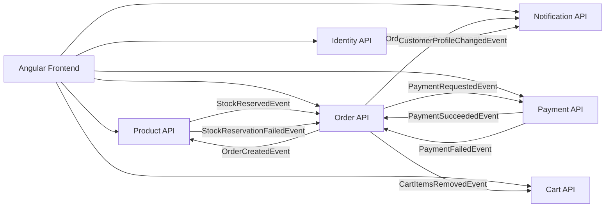
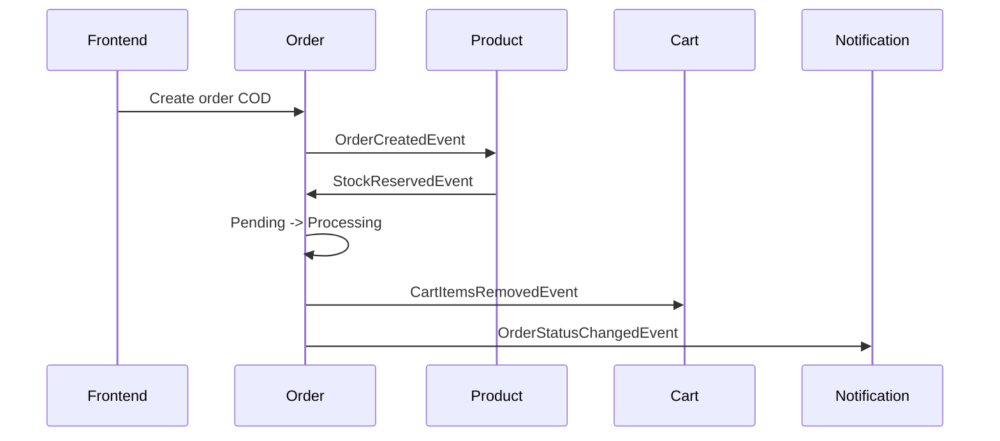
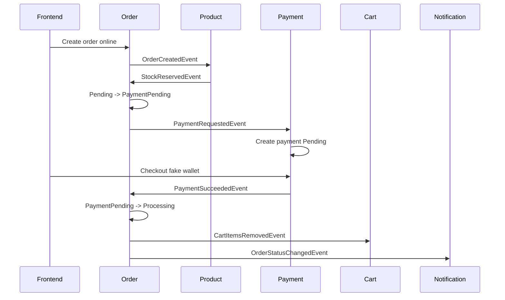

# Shopping Web - Trạng Thái Hiện Tại Và Roadmap

Ngày cập nhật: 2026-05-23

Tài liệu này dùng để nhắc lại dự án đang có gì, đã làm được gì, còn vấn đề nào chưa ổn, và nên phát triển tiếp theo hướng nào. Mục tiêu là để khi bạn hoặc bạn của bạn quay lại dự án sau vài ngày vẫn biết mình đang đứng ở đâu.

## 1. Bức Tranh Tổng Quan

Dự án hiện tại là một ecommerce microservices dùng .NET, RabbitMQ, PostgreSQL, Redis, Elasticsearch và Angular frontend.

Các service chính:

- `Identity`: đăng ký, đăng nhập, JWT, refresh token, session.
- `Product`: sản phẩm, danh mục, tồn kho, giữ kho, search.
- `Cart`: giỏ hàng bằng Redis.
- `Order`: tạo đơn, trạng thái đơn, xử lý COD/online payment.
- `Payment`: payment pending, fake wallet, webhook, payment timeout.
- `Notification`: in-app notification theo event.

Các building block:

- `ServiceDefault`: cấu hình chung cho API service.
- `EventBus`: contracts, filters, idempotency, migration helper.
- `AppHost`: chạy toàn bộ hệ thống bằng Aspire.

Luồng lớn hiện tại:



## 2. Infrastructure Đang Có

`AppHost` hiện quản lý:

- PostgreSQL
- RabbitMQ
- Redis
- Elasticsearch
- `identity-api`
- `product-api`
- `cart-api`
- `order-api`
- `payment-api`
- `notification-api`

Database đang tách riêng theo service:

- `identity-db`
- `product-db`
- `cart` dùng Redis, không có PostgreSQL riêng.
- `order-db`
- `payment-db`
- `notification-db`

Điểm tốt:

- Mỗi service sở hữu DB riêng.
- RabbitMQ dùng cho event flow.
- Redis dùng cho cart và idempotency.
- Elasticsearch được nối vào Product service.
- AppHost giúp chạy hệ thống đồng bộ hơn.

Điểm cần nhớ:

- Password/secret dev không nên xem là production secret.
- Nếu đổi user/password PostgreSQL mà volume cũ còn, có thể phải xóa volume trong môi trường dev.
- Elasticsearch hiện có nhưng search vẫn cần chuẩn hóa thêm.

## 3. Những Thứ Đã Làm Được

### 3.1 ServiceDefault

Đã có cấu hình dùng chung:

- Problem details.
- Health checks.
- HTTP logging.
- CORS.
- JWT authentication bằng RSA public key.

Ý nghĩa:

- Các service không cần copy cấu hình lặp lại.
- JWT giữa các service dùng cùng issuer/audience/public key.
- Identity là service duy nhất cần private key để ký token.

### 3.2 EventBus

Đã có:

- Event contracts.
- `ValidationFilter`.
- `IdempotencyFilter`.
- Migration helper.
- MassTransit integration.

Các event quan trọng:

- `OrderCreatedEvent`
- `OrderCancelledEvent`
- `OrderReturnedEvent`
- `OrderStatusChangedEvent`
- `StockReservedEvent`
- `StockReservationFailedEvent`
- `PaymentRequestedEvent`
- `PaymentSucceededEvent`
- `PaymentFailedEvent`
- `CartItemsRemovedEvent`
- `CustomerProfileChangedEvent`
- `ProductCreatedEvent`
- `ProductUpdatedEvent`
- `ProductDeletedEvent`

### 3.3 Identity Service

Đã có:

- Register.
- Login.
- Refresh token.
- Logout.
- List sessions.
- Revoke session.
- JWT bất đối xứng.
- Refresh token hash.
- Bảng `RefreshTokens` riêng.
- Multi-device/session.
- Publish `CustomerProfileChangedEvent`.

Điểm quan trọng:

- Refresh token gốc chỉ trả về client.
- DB chỉ lưu hash.
- Khi refresh thành công:
  - token cũ bị revoke.
  - token mới được tạo.
  - `ReplacedByTokenHash` ghi lại token thay thế.

Hạn chế còn lại:

- Access token đã cấp vẫn sống tới khi hết hạn.
- Chưa có blacklist access token.
- Private key vẫn cần đưa ra khỏi `appsettings` khi làm nghiêm túc.

### 3.4 Product Service

Đã có:

- Product/category endpoints.
- Product create/update/delete đi qua MQ.
- Product self consumers:
  - `ProductCreationConsumer`
  - `ProductUpdateConsumer`
  - `ProductDeleteConsumer`
- Stock reservation ledger.
- Release stock khi order cancelled/returned.
- Seed data khoảng 100 product.
- Elasticsearch sync/search.

Stock reservation hiện đã tốt hơn trước:

- Khi order tạo, Product giữ kho.
- Có bảng `StockReservations`.
- Unique theo `(OrderId, ProductId)`.
- Khi cancel/return, chỉ release nếu reservation chưa released.
- Giảm rủi ro duplicate event làm cộng kho hai lần.

Hạn chế còn lại:

- Update product thiếu validator riêng.
- Seed endpoint đang public.
- Elasticsearch document/search còn thô.

### 3.5 Cart Service

Đã có:

- Redis cart store.
- Get cart.
- Add item.
- Update item.
- Remove item.
- Clear cart.
- Consume `CartItemsRemovedEvent`.
- Remove nhiều item đã tối ưu bằng batch `HashDelete`.

Ý nghĩa:

- Cart nhanh, đơn giản, phù hợp dùng Redis.
- Khi order/payment thành công, Order publish event để Cart xóa item đã mua.

### 3.6 Order Service

Đã có:

- Create order.
- Get user orders.
- Get order detail.
- Admin get all orders.
- Cancel order.
- Request return.
- Approve/reject return.
- Ship.
- Deliver.
- Order timeout background job.

Order status hiện có:

- `Pending`
- `PaymentPending`
- `Processing`
- `Shipped`
- `Delivered`
- `ReturnRequested`
- `Returned`
- `ReturnRejected`
- `Cancelled`

Payment method hiện có:

- `COD`
- `MeiMei`
- `MeilyMeily`
- `CreditCard`
- `PayPal`

Consumers hiện có:

- `StockReservedConsumer`
- `StockReservationFailedConsumer`
- `PaymentSucceededConsumer`
- `PaymentFailedConsumer`

Luồng COD:



Luồng online payment:



Hạn chế còn lại:

- `OrderTimeoutService` đã publish `OrderStatusChangedEvent` khi tự hủy order pending quá hạn.
- `CreateOrderValidator` message payment method cần cập nhật cho đủ `MeiMei`, `MeilyMeily`.
- Idempotency ở create/cancel/return/admin action còn cần cải thiện.

### 3.7 Payment Service

Đã có:

- `PaymentRequestedConsumer`.
- Payment chỉ tạo `Pending`, không auto success.
- Provider abstraction:
  - `IPaymentProvider`
  - `FakeWalletPaymentProvider`
  - `MeiMeiPaymentProvider`
  - `MeilyMeilyPaymentProvider`
  - `PaymentProviderCatalog`
- Fake wallet checkout page.
- Payment webhook.
- Webhook HMAC signature + timestamp.
- Admin mock webhook.
- Payment timeout background job.
- Publish:
  - `PaymentSucceededEvent`
  - `PaymentFailedEvent`

Điểm tốt:

- Payment đã tách khỏi Order.
- User/cổng thanh toán mới là bên xác nhận thành công/thất bại.
- Fake wallet giúp test online payment flow.

Hạn chế còn lại:

- Fake wallet chỉ là dev/mock.
- Webhook secret cần đưa ra khỏi `appsettings`.
- Payment endpoint file còn khá dài, nên tách nhỏ sau.

### 3.8 Notification Service

Đã có:

- Service riêng.
- DB riêng.
- Entity:
  - `NotificationRecipient`
  - `NotificationMessage`
- Consume:
  - `CustomerProfileChangedEvent`
  - `OrderStatusChangedEvent`
- Endpoints:
  - get notifications
  - unread count
  - mark read
  - mark all read
  - admin list

Ý nghĩa:

- Notification không query trực tiếp DB của Identity/Order.
- Nó nhận event để tự tạo dữ liệu đọc riêng.

Hạn chế còn lại:

- Chưa có frontend notification bell.
- Chưa realtime.
- Chưa email/SMS/push.
- Existing users cần login lại để Notification có recipient projection.

### 3.9 Frontend Angular

Frontend hiện nằm ngoài repo backend:

```text
C:\Users\THUC\App\web-store-angular
```

Đã có:

- Product catalog.
- Product search.
- Cart.
- Checkout.
- Orders.
- Payment/pay now.
- Admin product management.
- Admin payment management.
- Fake wallet flow.
- `x-requestid` cho request không phải GET.

Hạn chế:

- Chưa đưa vào chung repo backend.
- Chưa có notification UI.
- App component khá lớn, nên tách dần.

## 4. Những Vấn Đề Cần Sửa Sớm

### P0 - Product Update Thiếu Validator

Hiện endpoint update product có:

```csharp
.AddEndpointFilter<ValidationFilter<UpdateProductRequest>>()
```

Nhưng chưa có `UpdateProductRequestValidator`.

Rủi ro:

- Update product có thể trả 500 vì DI không tìm thấy validator.

Việc cần làm:

- Thêm `UpdateProductRequestValidator`.

### P1 - Seed Product Endpoint Đang Public

Endpoint:

```text
POST /api/products/seed
```

Hiện chưa require admin.

Rủi ro:

- Ai gọi cũng có thể seed data.

Việc cần làm:

- Chỉ bật ở Development.
- Hoặc thêm:

```csharp
.RequireAuthorization(EndpointHelpers.AdminOnly)
```

### P1 - IdempotencyFilter Còn Yếu

Hiện key gần dạng:

```text
idempotency:{path}:{requestId}
```

Vấn đề:

- Chưa có HTTP method.
- Chưa có user/customer id.
- Chưa có body hash.
- Có thể cache lỗi 500.
- Processing lock TTL quá dài.

Việc cần làm:

- Key mới:

```text
idempotency:{method}:{path}:{userId}:{requestId}:{bodyHash}
```

- Không cache status code `>= 500`.
- Lock TTL ngắn, ví dụ 30 giây đến 2 phút.
- Success response TTL dài hơn, ví dụ 24 giờ.

### Đã xử lý - OrderTimeoutService Publish Event

Job timeout hiện đã:

- query order `Pending` quá hạn.
- đổi sang `Cancelled`.
- save DB.
- publish `OrderStatusChangedEvent`.

Ý nghĩa:

- Notification service sẽ nhận được event khi order bị tự hủy do timeout.
- Event đi qua MassTransit outbox cùng với `SaveChangesAsync`.

### P1 - Secret Vẫn Nằm Trong Appsettings

Cần đưa ra khỏi repo:

- Identity private key.
- Payment webhook secret.
- Dev password nếu muốn sạch hơn.

Việc cần làm:

- Dùng user-secrets trong dev.
- Dùng environment variables/secret store khi deploy.

### P1 - Elasticsearch Search Chưa Chuẩn

Vấn đề:

- Document thiếu field.
- Search chưa clamp page/pageSize.
- Có thể lộ debug info.
- Chưa có mapping/index alias rõ ràng.

Việc cần làm:

- Chuẩn hóa `ProductEsDocument`.
- Thêm mapping.
- Dùng alias kiểu:

```text
products-current -> products-v1
```

- Thêm filter/sort/pagination.

## 5. Roadmap Đề Xuất

### Sprint 1 - Dọn Nợ Kỹ Thuật Gần Nhất

Mục tiêu: làm hệ thống bớt lỗi ngầm.

Việc nên làm:

- Thêm `UpdateProductRequestValidator`.
- Khóa `/api/products/seed`.
- Sửa `CreateOrderValidator` message payment methods.
- Sửa `IdempotencyFilter`.
- Đưa secret ra khỏi `appsettings`.

Kết quả mong muốn:

- API ít lỗi bất ngờ hơn.
- Notification không mất event timeout.
- Retry/idempotency an toàn hơn.
- Security sạch hơn.

### Sprint 2 - Frontend Và Notification

Mục tiêu: user thấy được notification và frontend theo kịp backend.

Việc nên làm:

- Đưa frontend Angular vào repo:

```text
shopping-web/
  frontend/
    web-store-angular/
```

- Thêm `.gitignore` cho:
  - `node_modules/`
  - `dist/`
  - `.angular/`
- Thêm notification bell.
- Hiển thị unread count.
- Hiển thị notification list.
- Mark read/mark all read.

Kết quả mong muốn:

- Backend Notification có UI dùng thật.
- Frontend/backend đi chung version.

### Sprint 3 - Product Search Chuẩn Hơn

Mục tiêu: search đủ tốt cho ecommerce.

Việc nên làm:

- Chuẩn hóa `ProductEsDocument`.
- Bổ sung field:
  - `Id`
  - `Name`
  - `Description`
  - `ImageUrl`
  - `CategoryId`
  - `CategoryName`
  - `Price`
  - `StockQuantity`
  - `IsActive`
  - `UpdatedAt`
- Thêm filter:
  - keyword
  - category
  - min price
  - max price
  - in stock
- Thêm sort:
  - relevance
  - price asc
  - price desc
  - newest
- Thêm index mapping/alias.
- Không trả Elasticsearch debug info ra client.

Kết quả mong muốn:

- Product search dùng được cho catalog lớn hơn.
- Frontend không cần fallback quá nhiều.

### Sprint 4 - Testing

Mục tiêu: sửa code không còn sợ gãy flow.

Test nên có:

- Unit test domain:
  - Order status transition.
  - Payment status transition.
  - Stock reservation release.
- Integration test API:
  - Identity register/login/refresh.
  - Product create/update/delete.
  - Order create.
  - Payment checkout.
- Event flow test:
  - order -> product -> stock reserved -> order.
  - order -> payment requested -> payment succeeded -> cart removed.
  - payment failed -> order cancelled -> stock released.
  - order status changed -> notification created.

Kết quả mong muốn:

- Có test bảo vệ các flow chính.
- Bạn và bạn của bạn chia việc ít sợ đụng nhau hơn.

### Sprint 5 - Observability Và Deployment

Mục tiêu: hệ thống dễ debug khi chạy thật.

Việc nên làm:

- Thêm correlation id.
- Thêm OpenTelemetry tracing.
- Log chuẩn theo:
  - `OrderId`
  - `CustomerId`
  - `PaymentId`
  - `MessageId`
- Có docs xem RabbitMQ error queues.
- Có health check chi tiết hơn.
- Có strategy migration production.

Kết quả mong muốn:

- Khi lỗi event flow, biết lỗi nằm ở service nào.
- Dễ vận hành hơn.

## 6. Gợi Ý Chia Việc

Nếu có 2 người làm:

Người 1 thiên backend flow:

- Order timeout event.
- Idempotency.
- Product validator.
- Seed endpoint.
- Search/index.
- Tests backend.

Người 2 thiên frontend/tích hợp:

- Move Angular vào repo.
- Notification UI.
- Payment UI polish.
- Admin UX.
- Frontend service/component split.
- E2E/manual test script.

Nếu bạn của bạn chưa rành .NET:

- Cho làm frontend notification trước.
- Cho viết docs/manual test.
- Cho test API bằng Swagger/Postman.
- Cho làm UI admin/search.

## 7. Quyết Định Về Frontend Trong Repo

Nên đưa frontend vào chung repo, nhưng không để lẫn vào `src/Services`.

Cấu trúc đề xuất:

```text
shopping-web/
  AppHost/
  ServiceDefault/
  src/
    BuildingBlocks/
    Services/
  frontend/
    web-store-angular/
  docs/
```

Lý do nên đưa vào chung repo:

- Backend đổi API, frontend đổi theo cùng commit.
- Dễ pull về chạy demo.
- Dễ viết docs setup.
- Dễ kiểm soát version tương thích.

Không nên để:

```text
src/Services/web-store-angular
```

Vì frontend không phải .NET service.

## 8. Checklist Gần Nhất

Nên làm theo thứ tự:

- [ ] Thêm `UpdateProductRequestValidator`.
- [ ] Khóa `/api/products/seed`.
- [ ] Sửa message payment method trong `CreateOrderValidator`.
- [x] Sửa `OrderTimeoutService` publish `OrderStatusChangedEvent`.
- [ ] Sửa `IdempotencyFilter`.
- [ ] Đưa secret ra khỏi `appsettings`.
- [ ] Move frontend vào `frontend/web-store-angular`.
- [ ] Thêm notification UI.
- [ ] Chuẩn hóa Elasticsearch search.
- [ ] Bắt đầu test project.

## 9. Kết Luận

Dự án hiện không còn là demo CRUD đơn giản nữa. Nó đã có nền microservices khá rõ:

- service tách theo domain.
- DB riêng.
- event-driven flow.
- outbox/inbox.
- stock reservation.
- payment service.
- notification service.
- fake wallet để test online payment.
- refresh token multi-session.

Giai đoạn tiếp theo nên tập trung vào độ chắc:

- validation.
- idempotency.
- secret management.
- timeout event.
- search chuẩn.
- frontend notification.
- testing.

Khi các phần này ổn, dự án sẽ chuyển từ "chạy được" sang "có thể bảo trì và mở rộng được".
